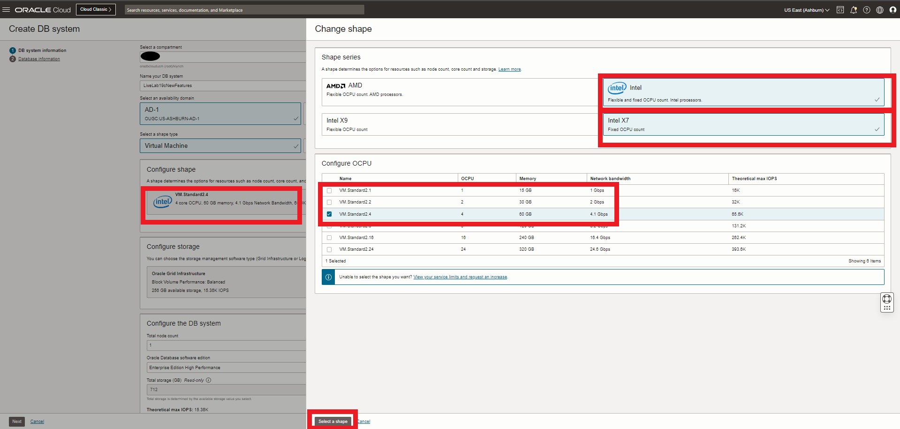

# Create a 19C DBCS VM Database and VCN

## Introduction

This lab walks you through the steps to create a virtual cloud network (VCN) and an instance of an Oracle 19c Database running in Oracle Cloud Infrastructure. Oracle Cloud Infrastructure provides several options for rapidly creating a Database system for development and testing, including fast provisioning of 1-node virtual machine database systems.

A virtual cloud network (VCN) provides the necessary network Infrastructure required to support resources, including Oracle Database instances. This includes a gateway, route tables, security lists, DNS and so on. 

Estimated Lab Time: 35 minutes

### Objectives
* Create a VCN 
* Create a Single Node 19c DBCS VM 
* Login to your environment

### Prerequisites

* An Oracle Account
* SSH Keys
  
## Task 1: Create a Virtual Cloud Network instance
Fortunately, Oracle Cloud Infrastructure provides a wizard that simplifies the creation of a basic, public internet accessible VCN.

1. Login to Oracle Cloud
2. Click the **Navigation Menu** in the upper left, navigate to **Networking**, and select **Virtual Cloud Networks**.

	

2. Select your compartment and click on **Start VCN Wizard**. If you haven't created any compartments yet, just leave it as the default (root) compartment.  If you were assigned a compartment, enter it here.

  

3. Be sure the default "VCN with Internet Connectivity" is selected and click **Start VCN Wizard**.

  

4. Enter **bd19cnf** as the name of your VCN, be sure to double check this as it will be needed in a script later in the lab. Enter the default values for the VCN CIDR block(10.0.0.0/16), Public Subnet CIDR block (10.0.0.0/24) and Private CIDR block (10.0.1.0/24), and click **Next**.

  

5. Review your selections on the next screen and click **Create**.

  

6. On the summary screen, click **View Virtual Cloud Network**.
   
## Task 2: Create a Database Virtual Machine

1. From the Console menu, click on **Bare Metal, VM, and Exadata**.

  

2. Select the compartment you want to create the database in and click on **Create DB System**.

  

3. On the DB System Information form, enter the following information and click **Next**  when done entering the following

    * **Select a compartment**:  Select the compartment you used for your VCN
    * **Name your DB system**: Give your database a name
    * **Select an availability domain**:  Choose an AD
    * **Select a shape type**:  Choose *Virtual Machine*
    * **Select a shape**: *VM Standard2.4* (If you are in a Free Trial account, choose the smaller *VM Standard 2.2* shape, keep in mind that this will increase provisioning time, VMStandard2.2 is the recommended minimum)
    * **Configure Storage**: Leave this as is
    * **Configure the DB system - Node count**: *1* 
    * **Configure the DB system - Software edition**: *Enterprise Edition High Performance*
    * **Add public SSH keys**: Paste your public key from Lab 1.  If you are in Cloud Shell use the Paste option and ensure you paste a single line (paste in notepad to check it is one line).  If you are using a terminal browse to the location of your SSH keys and select the public key file (with a .pub extension). *Note:  Ensure you paste a one line file if using Cloud Shell*
    * **Choose a license type**: Pick *License included*
    * **Specify the Network information - Virtual Cloud Network**: Select the VCN you created using the drop down list
    * **Specify the Network information - Client subnet**:  *Public subnet* using the drop down list.
    * **Hostname prefix**:  Enter **nf19c**

    


4. On the Database Information form, enter the following information and click **Create DB System**.

    * **Database name**: Change default database name to "cdb1".
    * **Database image**: Click the **Change Database Image** button and select *19c*
    * **PDB name** field, enter "pdb1".
    * **Create administrator credentials**: Use the password **`WElcome123##`** for your sys user in the **Password** field and then repeat the password in the **Confirm password** field.  This password will be used for all exercises in the 19c workshop series.  Please enter it carefully.
    * Accept all other defaults.

    


5. After a few minutes, your Database System will change color from yellow (Provisioning) to green.  *Note:  If you use a smaller VM Shape, the provisioning may take longer*.  If you encounter any errors, please see our Appendix: Troubleshooting tips

    

## Task 3: Gather system details and connect to the Database using SSH

1. From the Database System Details page (the same page as the screenshot above) scroll down and click **Nodes**  on the left side of the screen to gather your IP address. Note your Public IP Address

  

2. In Cloud Shell or your terminal window, **navigate to the folder** where you created the SSH keys and enter this command, using your IP address:

    ```
    $ <copy>ssh -i ./myOracleCloudKey opc@</copy>< your_IP_address >
    ```
    

3. Once connected, you can switch to the "oracle" OS user and connect using SQL*Plus:

    ```
    <copy>
    sudo su - oracle
    </copy>
    ```

You may now **proceed to the next lab**.

## **APPENDIX:** Troubleshooting tips

### Potential Error 1:  You receive a service limit error
Error:  Renderable Exception From Internal-API.You have reached your service limit of 2 Virtual Machine CPU Cores in this Availability Domain. Please try launching the instance in a different Availability Domain or Region, or try using a different shape. If you have reached all Service limits, please contact Oracle support to request a limit increase.
1. Click on the hamburger menu.  
2. Go to Governance -> Limits, Quota and Usage
3. Click on the SCOPE drop down and select the AD (Availability Domain) you are working in
4. Search for standard2-core-count and note the number of cores. 
5. This lab requires a minimum of 2 cores.  VMStandard2.2 means a compute with 2 cores.  
6. Select a different compute size based on your tenancy's availability

## Want to Learn More?

* [Oracle Cloud Infrastructure: Creating Bare Metal and Virtual Machine DB Systems](https://docs.cloud.oracle.com/en-us/iaas/Content/Database/Tasks/creatingDBsystem.htm)
* [Oracle Cloud Infrastructure: Connecting to a DB System](https://docs.cloud.oracle.com/en-us/iaas/Content/Database/Tasks/connectingDB.htm)

## Acknowledgements
* **Author** - Kay Malcolm, Database Product Management
* **Last Updated By/Date** - Killian Lynch, February 2023