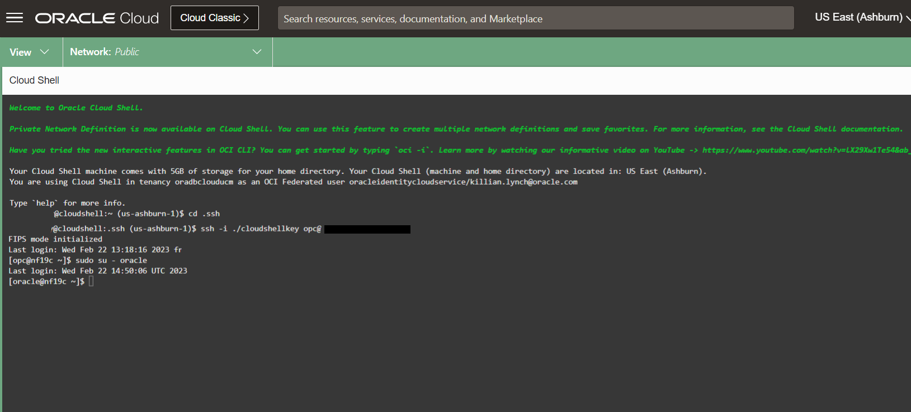
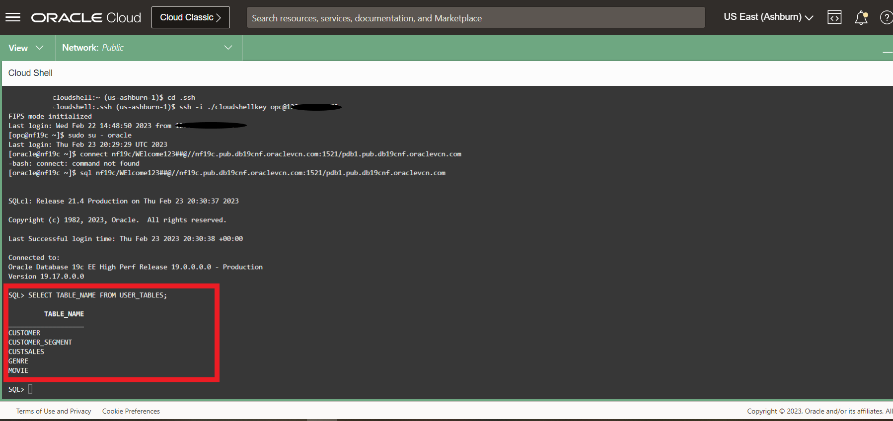

# Sample Schema Setup

## Introduction
This lab will show you how to setup your database schemas for the subsequent labs.

Estimated Time: 10 minutes

### Objectives
 
In this lab, you will setup sample schema:
* Set the environment variables 
* Get the Database sample schemas and unzip them
* Install the Sample Schemas

### Prerequisites 
This lab assumes you have:

* A LiveLabs Cloud account and assigned compartment
* The IP address and instance name for your DB19c Compute instance
* Successfully logged into your LiveLabs account
* A Valid SSH Key Pair

## Task: Install Sample Data

To make this workshop as realistic as possible, let us introduce the business scenario you will use during this workshop - **Oracle MovieStream**.


Oracle MovieStream is a fictitious online movie streaming company. Customers log into Oracle MovieStream using their computers, tablets and phones where they are presented with a targeted list of movies based on their past viewing habits. The company is now looking for better, smarter ways to track performance, identifying customers to target with campaigns that promote new services, new movies and new viewing platforms. Many of the scenarios in this workshop will based on challenges companies are seeing in their own businesses and we hope the following labs and accompanying workshops will give you some insight into how Oracle can help you solve these common everyday business and technical challenges.

1. Run a *whoami* to ensure the value *oracle* comes back.)

    Note: If you are running in Windows using putty, ensure your Session Timeout is set to greater than 0.
    ```
    <copy>whoami</copy>
    ```

2. If you are not the oracle user, log back in:
    ````
    <copy>
    sudo su - oracle
    </copy>
    ````
    
    

3.  Set the environment variables to point to the Oracle binaries.  When prompted for the SID (Oracle Database System Identifier), enter **ORCL**.
    ````
    <copy>
    . oraenv
    </copy>
    ORCL
    ````

4. Get the Database sample schemas and unzip them. Then set the up the environment with these scripts. **This will take about 3 minutes to run**(time may vary depending on the shape of the database you created).

    ````
    <copy>
    wget https://github.com/KillianLynch/kl_moviestream/archive/main.zip
    unzip main.zip
    cd kl_moviestream-main
    chmod u+x ./setup_lab_user.sh
    ./setup_lab_user.sh
    </copy>
    ````


5.  Login using SQL*Plus as the newly created lab user **nf19c** user.  

    ````
    <copy>
    sql nf19c/WElcome123##@//nf19c.pub.db19cnf.oraclevcn.com:1521/pdb1.pub.db19cnf.oraclevcn.com
    </copy>
    ````

6.  Check the script correctly installed the tables. You should see the following tables. CUSTOMER, CUSTOMER_SEGMENTS, CUSTSALES, GENRE, and MOVIE.

    ````
    <copy>
    select table_name from user_tables;
    </copy>
    ````
    

Congratulations! Now you have the environment to run the labs.

You may now **proceed to the next lab**.

## Oracle Database Sample Schemas Agreement

Copyright (c) 2019 Oracle

Permission is hereby granted, free of charge, to any person obtaining a copy of this software and associated documentation files (the "Software"), to deal in the Software without restriction, including without limitation the rights to use, copy, modify, merge, publish, distribute, sublicense, and/or sell copies of the Software, and to permit persons to whom the Software is furnished to do so, subject to the following conditions:

The above copyright notice and this permission notice shall be included in all copies or substantial portions of the Software.

*THE SOFTWARE IS PROVIDED "AS IS", WITHOUT WARRANTY OF ANY KIND, EXPRESS OR IMPLIED, INCLUDING BUT NOT LIMITED TO THE WARRANTIES OF MERCHANTABILITY, FITNESS FOR A PARTICULAR PURPOSE AND NONINFRINGEMENT. IN NO EVENT SHALL THE AUTHORS OR COPYRIGHT HOLDERS BE LIABLE FOR ANY CLAIM, DAMAGES OR OTHER LIABILITY, WHETHER IN AN ACTION OF CONTRACT, TORT OR OTHERWISE, ARISING FROM, OUT OF OR IN CONNECTION WITH THE SOFTWARE OR THE USE OR OTHER DEALINGS IN THE SOFTWARE.*

## **Acknowledgements**

- **Author** - Killian Lynch, DB Product Management
- **Contributors** - 
* **Last Updated By/Date** -  Killian Lynch, Feb 2023