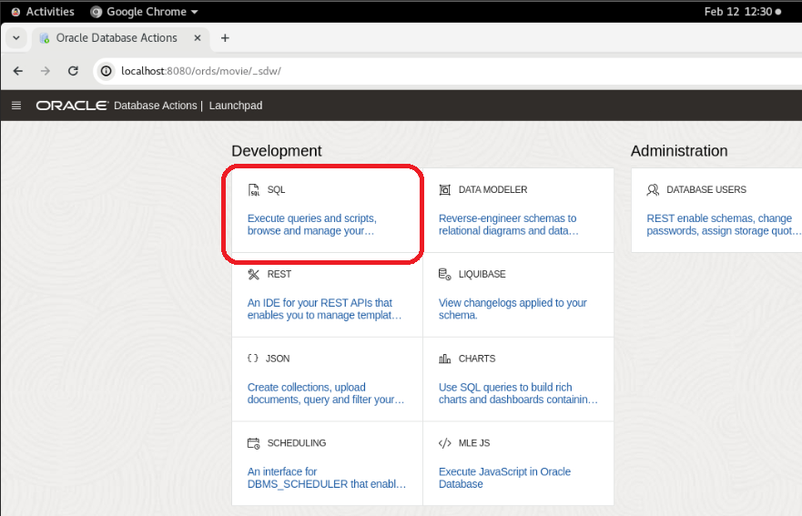
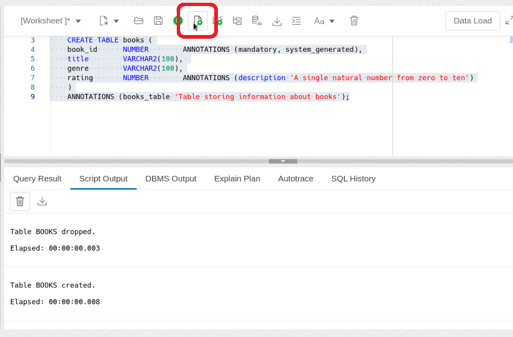
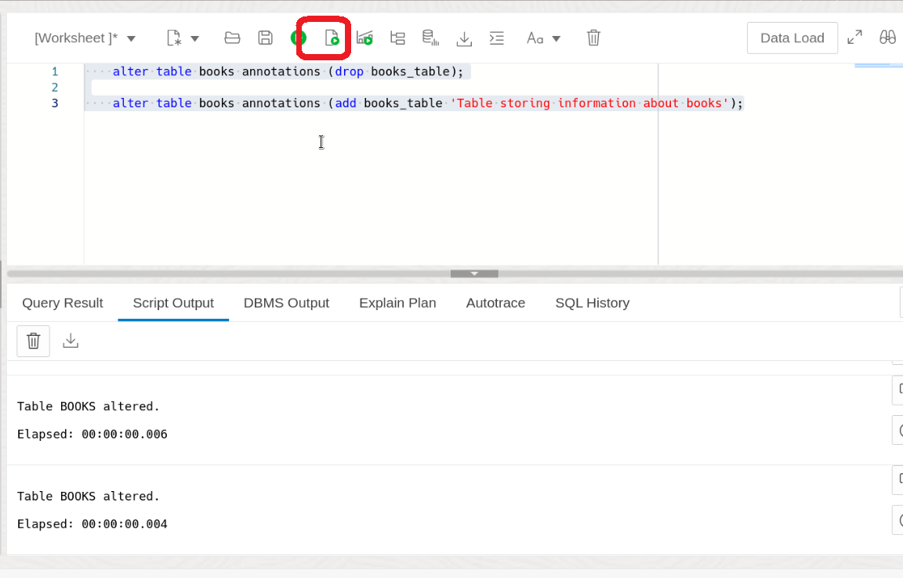
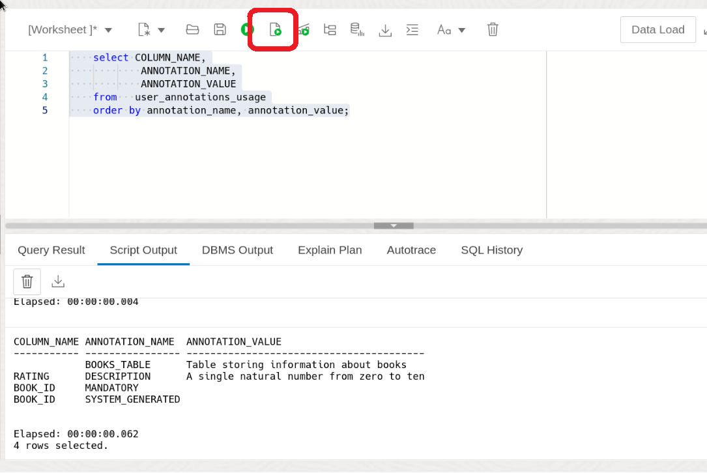

# Annotation Exploration in Oracle Database 23ai

## Introduction

Welcome to the "Annotation Exploration in Oracle Database 23ai" lab! Annotations serve as a powerful tool for documenting and classifying various database objects, providing valuable insights into their purpose and usage.

In today's technology-driven world, efficient documentation and organization of database objects are essential for smooth operation and maintenance of database systems. Annotations, as an extension of traditional comments, offer a more structured and versatile approach to database documentation. They allow us to associate name-value pairs with database objects, enabling us to describe, classify, and categorize them according to our specific requirements.

Estimated Lab Time: 10 minutes

### Objective:
The objective of this lab is to provide hands-on experience with annotations in Oracle Database 23ai. You will learn how to use annotations to document and classify various database objects, and understand how to query and manipulate annotations using SQL.

### Prerequisites:
- Access to Oracle Database 23ai.
- Basic understanding of SQL is helpful.

## Task 1: Lab setup

1. To begin, let's set up the lab environment. First, ensure that the lab setup script is executable by running the following command:

    ```
    <copy>
    chmod +x setup.sh
    </copy>
    ```
    

2. Execute the setup script by running:

    ```
    <copy>
    ./setup.sh
    </copy>
    ```

    

3. Now, paste the following URL into the Google Chrome search bar:

    ```
    <copy>
    http://localhost:8080/ords/sql-developer
    </copy>
    ```
    


4. Sign in to SQL Developer Web using the movie schema with the **username movie and password movie**.

    

5. Click on the SQL tile.

    


## Task 2: Adding Annotations
1. Why Use Annotations? Annotations provide a way to add additional property metadata for database objects, such as tables, columns, views, materialized views and even domains. 

    Compared to comments, annotations offer more flexibility. They can be used with various types of database elements, not just tables. Also, you can attach multiple annotations to the same object, which isn't possible with comments. Annotations are keys with optional values. You can use them to record any metadata you want about the object in question. This is important because there is no set format for comments. So which do you use, JSON? XML? Delimited key-value pairs? And on top of this, how do you enforce the format for all future maintainers? 

    Thats where Annotations come in. Lets take a look.

    Execute the SQl commands to create a table `books`.The `books` table stores information about books, including the title and author ID.
    
    ```
    <copy>
    DROP TABLE IF EXISTS books;
    
    CREATE TABLE books (
    book_id      NUMBER        ANNOTATIONS (mandatory, system_generated),
    title        VARCHAR2(100), 
    genre        VARCHAR2(100),
    rating       NUMBER        ANNOTATIONS (description 'A single natural number from zero to ten')
    )
    ANNOTATIONS (books_table 'Table storing information about books');

    </copy>
    ```

    What do they mean then?

    * 'mandatory': Notice this annotation doesn't require a value. The name is enough to provide the meaning.
    * 'system\_generated': Again, this is enough to tell us that the book_id is system generated.
    * 'description': This annotation indicates what type of rating users should store for a book, here wer are saying any whole number 0-10.
    * 'Books Table': Describes the purpose of the books table.

    

2. You can also update objects to add or drop annotations. For example we could drop and add the annotation for the books table
    ```
    <copy>
    alter table books annotations (drop books_table);

    alter table books annotations (add books_table 'Table storing information about books');
    </copy>
    ```
    


3. Now that we have annotations we can view them with the *_usage_annotations views

    ```
    <copy>
    select COLUMN_NAME,
            ANNOTATION_NAME,
            ANNOTATION_VALUE
    from   user_annotations_usage
    order by annotation_name, annotation_value;
    </copy>
    ```
    These views show annotations for all object types. This means they’re all accessible in one location, which makes it simple to access annotations programmatically to generate separate documentation if you want.

    


4. Annotations offer a structured and flexible approach to documenting and classifying various database objects, enhancing the overall organization and maintenance of database systems. By associating name-value pairs with database objects, annotations enable users to describe, categorize, and classify objects according to specific requirements. 

In conclusion, this lab has provided a quick  into the usage and implementation of annotations in Oracle Database 23ai. If you're interested in trying out more, feel free to test out your own annotations now.  

This concludes the Annotations Lab.


## Learn More

* [Database Development Guide](https://docs.oracle.com/en/database/oracle/oracle-database/23/adfns/registering-application-data-usage-database.html#GUID-2DAF069E-0938-40AF-B05B-75AFE71D666C)
* [SQL Language Reference](https://docs.oracle.com/en/database/oracle/oracle-database/23/sqlrf/CREATE-TABLE.html#GUID-F9CE0CC3-13AE-4744-A43C-EAC7A71AAAB6)


## Acknowledgements
* **Author** - Killian Lynch, Oracle Database Product Manager
* **Contributors** - Chris Saxon, Senior Developer Advocate, Dom Giles, Distinguished Database Product Manager
* **Last Updated By/Date** - Killian Lynch, Oracle Database Product Management, Product Manager, May 2023