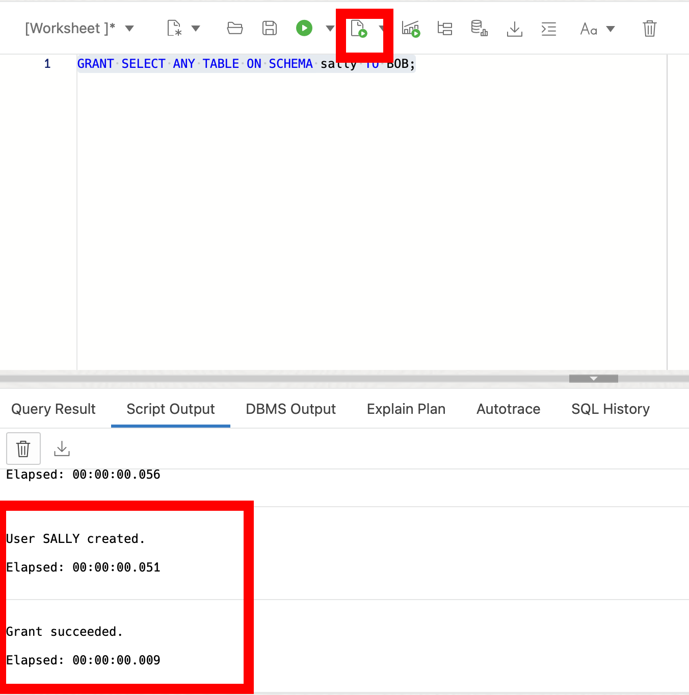

# Working with Schema-Level Privileges

## Introduction

Welcome to the Working with Schema-Level Privileges workshop. In this workshop, you will learn how to work with the new schema-level privilege management feature introduced in Oracle Database 23ai. 

Estimated Lab Time: 15 minutes

### Objective:
The objective of this workshop is to learn how to work with the schema-level privilege grant in Oracle Database 23ai and demonstrate its practical applications for managing access to application schemas in an easy way. 

### Prerequisites:
- Access to Oracle Database 23ai.
- Basic understanding of database schemas and privileges is recommended.

## Task 1: Understanding Schema-Level Privileges

1. Before we get into the code examples, let's briefly talk about the traditional methods of privilege management in Oracle databases.

    * **Individual Privilege Grants**: This involves granting individual privileges on each table or view in the application schema. While granular, it's cumbersome and could cause user errors, especially with schema changes.

    * **ANY Privileges**: Granting "ANY" privileges (e.g., `SELECT ANY TABLE`) provides broad access but compromises security by granting excessive permissions.

    * Oracle Database 23ai introduces a simpler approach: **Schema-Level Privileges**. This allows granting privileges at the schema level, offering a balance between granularity and convenience.

## Task 2: Benefiting from Schema-Level Privileges

1. From the Autonomous Database home page, **click** Database action and then **click** SQL.
    

2. Let's now look at the syntax and usage of schema-level privileges in Oracle Database 23ai. First we'll add a test user.

    ```
    <copy>
    drop user if exists bob;
    drop user if exists sally;
    create user bob identified by Oracle123long;
    create user sally identified by Oracle123long;
    </copy>
    ```
    

    Now we can grant our bob user to sally's schema to 

    ```
    <copy>
    GRANT SELECT ANY TABLE ON SCHEMA sally TO BOB;
    </copy>
    ```
    


    This single grant provides user BOB with SELECT privileges on all tables and views within the schema sally uses, ensuring access without compromising security.

3. Schema-level privileges dynamically adapt to schema changes. If new tables or views are added to the HR schema, users granted schema-level privileges instantly gain access without additional management.

4. Oracle Database 23ai simplifies privilege management with dedicated views. We can use views like `DBA_SCHEMA_PRIVS` to check the schema-level privileges granted to users.

    ```
    <copy>
    SELECT * FROM DBA_SCHEMA_PRIVS WHERE GRANTEE = 'BOB';
    </copy>
    ```
    


## Task 4: Leveraging Advanced Privilege Management

1. You can also grant schema-level privileges on schemas without special privileges. However, granting privileges on other schemas requires additional privileges like GRANT ANY SCHEMA PRIVILEGE.

2. Oracle Database 23ai provides simple access into schema-level privileges through views like ROLE\_SCHEMA\_PRIVS, USER\_SCHEMA\_PRIVS, and SESSION\_SCHEMA\_PRIVS.

3. In this lab, you've explored the schema-level privilege management in Oracle Database 23ai. By using schema-level privileges, you can drastically reduce the management and administration needed to grant schema privileges prior to 23ai and improve security through their use.

## Learn More

- [Oracle Database 23ai Documentation](https://docs.oracle.com/en/database/oracle/oracle-database/index.html)
- [Oracle Blog - Exploring Schema-Level Privileges](https://blogs.oracle.com/cloudsecurity/post/schemalevel-privilege-grants-with-database-23c)

## Acknowledgements
* **Author** - Killian Lynch, Database Product Management
* **Contributors** - Dom Giles, Distinguished Database Product Manager
* **Last Updated By/Date** - Killian Lynch, April 2024
