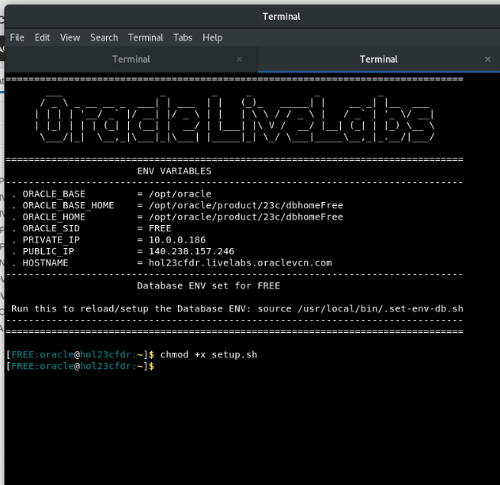
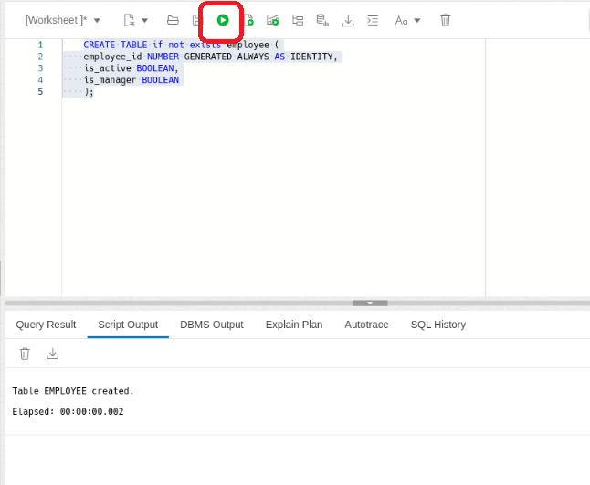
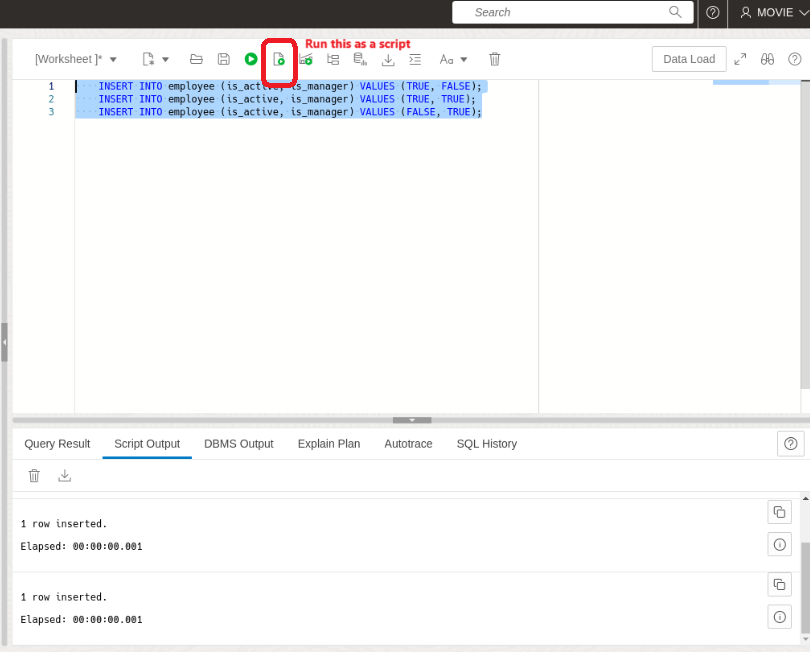
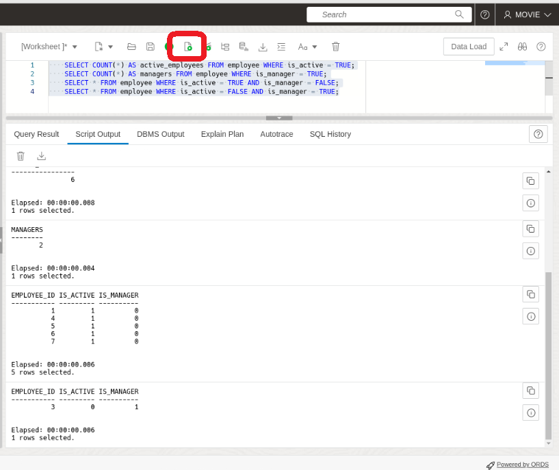
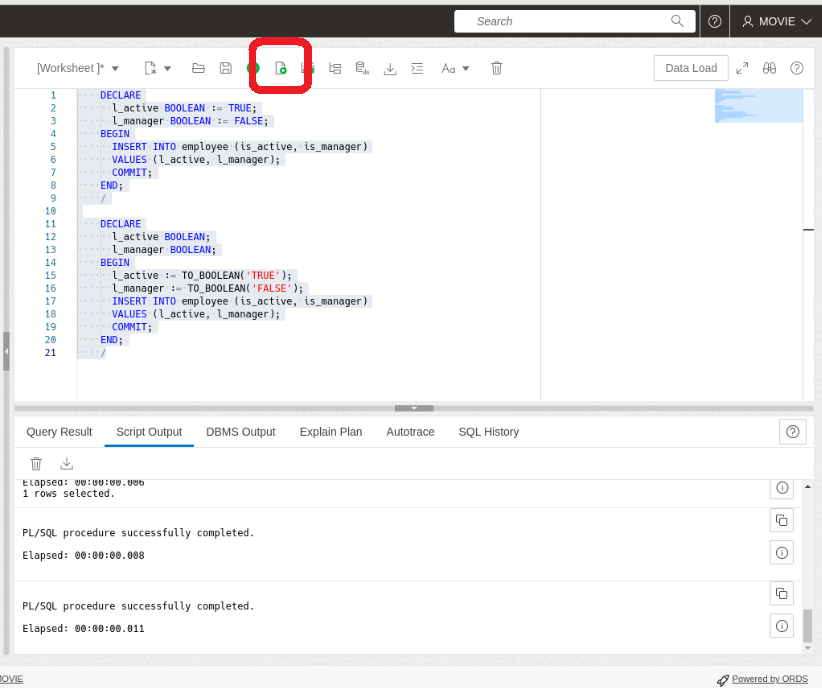

# Boolean Data Type: Exploring Boolean Functionality in Oracle Database 23c

## Introduction

Welcome to the Boolean Data Type Lab for Oracle Database 23c! In this lab, you will delve into the intricacies of working with boolean data types within Oracle Database 23c. Booleans are essential for representing true/false or yes/no conditions in databases, allowing for more nuanced data manipulation and querying.

Oracle Database 23c introduces native support for boolean data types, expanding the capabilities of SQL and PL/SQL. Understanding how to define, insert, query, and manipulate boolean data is fundamental for effective database management and application development.

Through a series of hands-on exercises, you will learn how to create tables with boolean columns, insert data with boolean values, perform boolean operations in SQL queries, utilize boolean types in PL/SQL, and explore advanced boolean operations. By the end of this lab, you will have a comprehensive understanding of boolean functionality in Oracle Database 23c, empowering you to leverage this powerful feature in your database projects.

Let's dive in and explore the world of boolean data types in Oracle Database 23c!

### Objective:
In this lab, you will explore the boolean data type introduced in Oracle Database 23c. You will learn how to define boolean columns, insert boolean values, perform boolean operations in SQL queries, and utilize boolean types in PL/SQL.

### Prerequisites:
- Access to Oracle Database 23c environment.
- Basic understanding of SQL and PL/SQL.

## Task 1: Lab Setup

1. To begin, let's set up the lab environment. First, ensure that the lab setup script is executable by running the following command:

    ```
    <copy>
    chmod +x setup.sh
    </copy>
    ```
    

2. Execute the setup script by running:

    ```
    <copy>
    ./setup.sh
    </copy>
    ```

    

3. Now, paste the following URL into the Google Chrome search bar:

    ```
    <copy>
    http://localhost:8080/ords/sql-developer
    </copy>
    ```
    


4. Sign in to SQL Developer Web using the movie schema with the **username movie and password movie**.

    

5. Click on the SQL tile.

    

6. Let's create some tables to use in the lab. Copy and run the following SQL script:

    ```
    <copy>
    CREATE TABLE if not exists employee (
    employee_id NUMBER GENERATED ALWAYS AS IDENTITY,
    is_active BOOLEAN,
    is_manager BOOLEAN
    );
    </copy>
    ```
    

7. Insert several rows into the `employee` table with different boolean values for the `is_active` and `is_manager` columns.

    ```
    <copy>
    INSERT INTO employee (is_active, is_manager) VALUES (TRUE, FALSE);
    INSERT INTO employee (is_active, is_manager) VALUES (TRUE, TRUE);
    INSERT INTO employee (is_active, is_manager) VALUES (FALSE, TRUE);
    </copy>
    ```
    

## Task 2: Working with Boolean Data

1. Let's start by writing SQL queries to perform various operations on boolean data:
    - Count the total number of active employees.
    - Count the total number of managers.
    - Retrieve all active employees who are not managers.
    - Retrieve all inactive employees who are managers.

    ```
    <copy>
    SELECT COUNT(*) AS active_employees FROM employee WHERE is_active = TRUE;
    SELECT COUNT(*) AS managers FROM employee WHERE is_manager = TRUE;
    SELECT * FROM employee WHERE is_active = TRUE AND is_manager = FALSE;
    SELECT * FROM employee WHERE is_active = FALSE AND is_manager = TRUE;
    </copy>
    ```
    

2. Additionally, let's write a PL/SQL block to:
    - Insert a record into the `employee` table with predefined boolean values.
    - Use the `TO_BOOLEAN` function to convert string literals into boolean values.

    ```
    <copy>
    DECLARE
      l_active BOOLEAN := TRUE;
      l_manager BOOLEAN := FALSE;
    BEGIN
      INSERT INTO employee (is_active, is_manager)
      VALUES (l_active, l_manager);
      COMMIT;
    END;
    /

    DECLARE
      l_active BOOLEAN;
      l_manager BOOLEAN;
    BEGIN
      l_active := TO_BOOLEAN('TRUE');
      l_manager := TO_BOOLEAN('FALSE');
      INSERT INTO employee (is_active, is_manager)
      VALUES (l_active, l_manager);
      COMMIT;
    END;
    /
    </copy>
    ```
    

3. In this lab, you gained hands-on experience with the boolean data type in Oracle Database 23c. You learned how to define boolean columns, insert boolean values, perform boolean operations in SQL queries, and utilize boolean types in PL/SQL. Understanding boolean functionality is crucial for effective data manipulation and decision-making in database systems.

Feel free to experiment further with boolean operations and integrate them into your own projects for enhanced data management capabilities.

## Learn More

* [Introducing Oracle Database 23c Boolean Data Type](https://medium.com/oracledevs/boolean-data-type-in-oracle-database-23c-b9ae541c697f)
* [Boolean Data Type Documentation](https://docs.oracle.com/en/database/oracle/oracle-database/23/nfcoa/application-development.html)

## Acknowledgements
* **Author** - Killian Lynch, Database Product Management
* **Contributors** - Killian Lynch, Database Product Management
* **Last Updated By/Date** - Killian Lynch, January 2023
