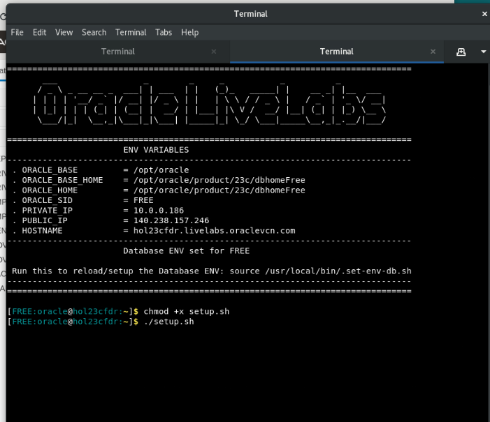
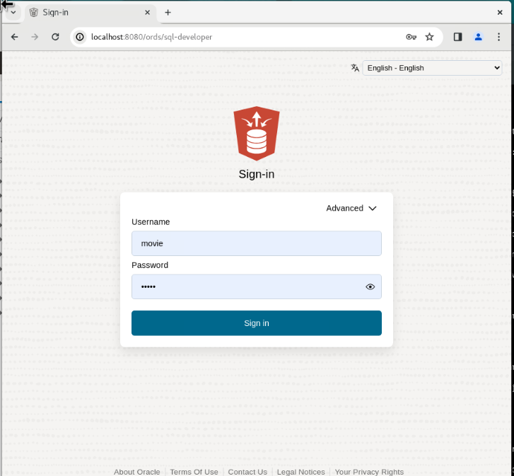
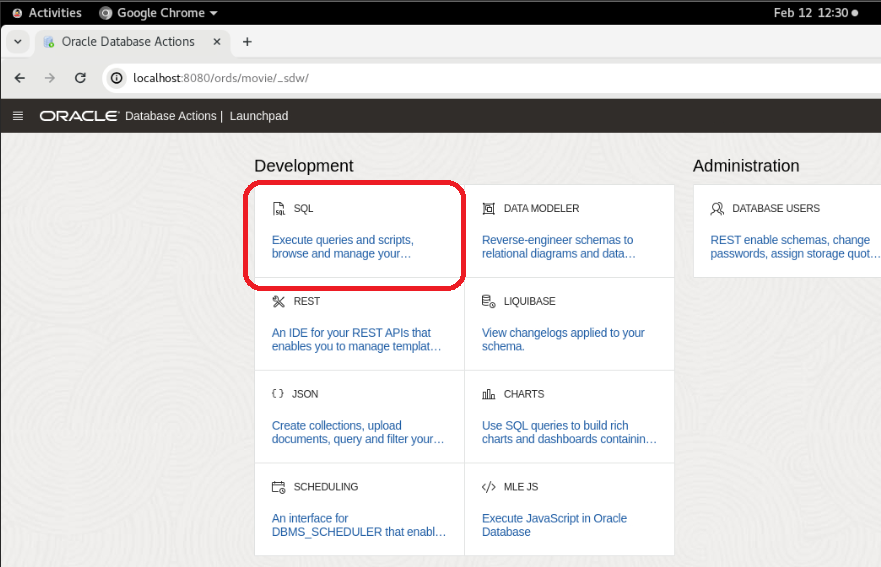
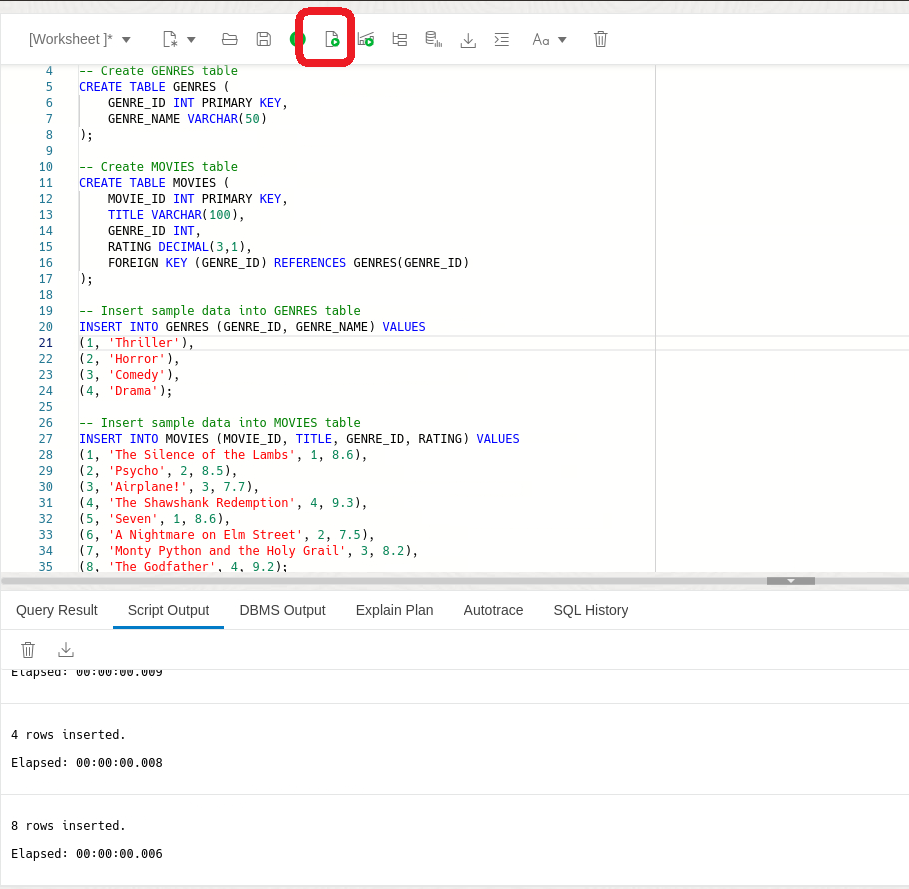
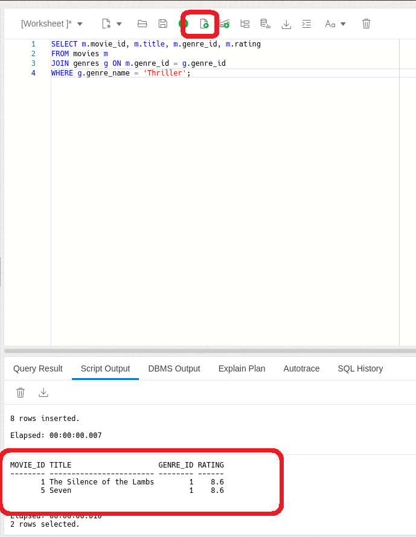
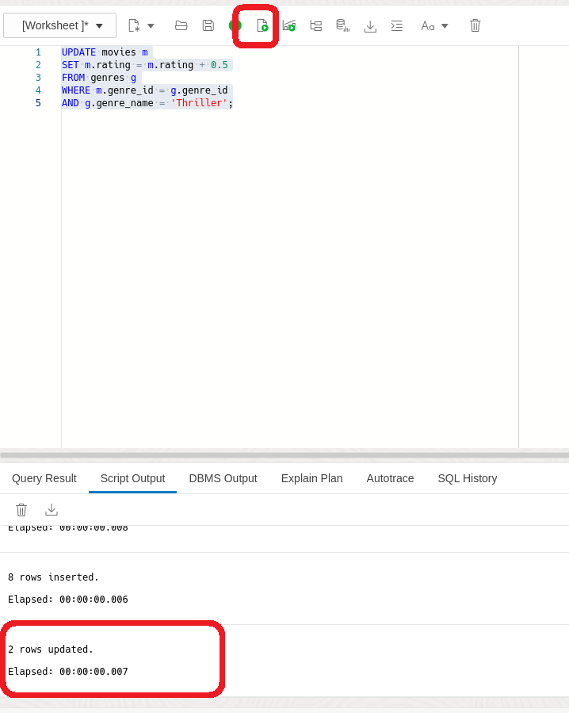
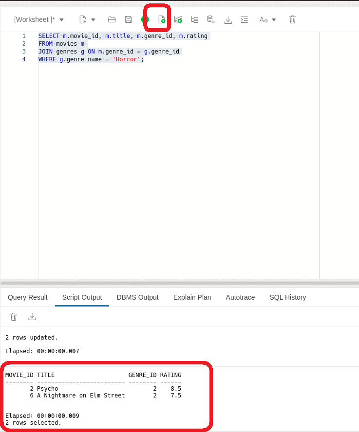

# Simplifying Data Manipulation in SQL with Direct Joins

## Introduction

Welcome to the "Direct Joins Workshop: Simplifying Data Manipulation in SQL"! In this workshop, you'll learn about the new 23c feature called direct joins in SQL. Direct joins allow you to easily update and delete data across multiple related tables. They're like shortcuts that make your SQL queries more efficient and straightforward.

### Objective:
The goal of this workshop is to help you understand and use direct joins effectively in SQL. By the end of this workshop, you'll be able to confidently update and delete data across tables, making your database management tasks much easier.

### Prerequisites:
- Access to Oracle Database 23c.
- Basic understanding of SQL is helpful.

## Task 1: Lab setup

1. To begin, let's set up the lab environment. First, ensure that the lab setup script is executable by running the following command:

    ```
    <copy>
    chmod +x setup.sh
    </copy>
    ```
    

2. Execute the setup script by running:

    ```
    <copy>
    ./setup.sh
    </copy>
    ```

    

3. Now, paste the following URL into the Google Chrome search bar:

    ```
    <copy>
    http://localhost:8080/ords/sql-developer
    </copy>
    ```
    


4. Sign in to SQL Developer Web using the movie schema with the **username movie and password movie**.

    

5. Click on the SQL tile.

    
   

## Task 2: Working with direct joins

1. Imagine you're the administrator of a comprehensive movie database, brimming with information on thousands of films, from timeless classics to the latest blockbusters. Your task? To boost the ratings of Thriller movies that fall below a certain threshold, ensuring your users always have top-tier thriller recommendations.


    ```
    <copy>
    DROP TABLE if exists GENRES CASCADE CONSTRAINT;
    DROP TABLE if exists MOVIES CASCADE CONSTRAINT;
    
    -- Create GENRES table
    CREATE TABLE GENRES (
        GENRE_ID INT PRIMARY KEY,
        GENRE_NAME VARCHAR(50)
    );

    -- Create MOVIES table
    CREATE TABLE MOVIES (
        MOVIE_ID INT PRIMARY KEY,
        TITLE VARCHAR(100),
        GENRE_ID INT,
        RATING DECIMAL(3,1),
        FOREIGN KEY (GENRE_ID) REFERENCES GENRES(GENRE_ID)
    );

    -- Insert sample data into GENRES table
    INSERT INTO GENRES (GENRE_ID, GENRE_NAME) VALUES
    (1, 'Thriller'),
    (2, 'Horror'),
    (3, 'Comedy'),
    (4, 'Drama');

    -- Insert sample data into MOVIES table
    INSERT INTO MOVIES (MOVIE_ID, TITLE, GENRE_ID, RATING) VALUES
    (1, 'The Silence of the Lambs', 1, 8.6),
    (2, 'Psycho', 2, 8.5),
    (3, 'Airplane!', 3, 7.7),
    (4, 'The Shawshank Redemption', 4, 9.3),
    (5, 'Seven', 1, 8.6),
    (6, 'A Nightmare on Elm Street', 2, 7.5),
    (7, 'Monty Python and the Holy Grail', 3, 8.2),
    (8, 'The Godfather', 4, 9.2);
    </copy>
    ```
    

2. First we'll take a look at all of our thriller movies and their  ratings 

    ```
    <copy>
    SELECT m.movie_id, m.title, m.genre_id, m.rating
    FROM movies m
    JOIN genres g ON m.genre_id = g.genre_id
    WHERE g.genre_name = 'Thriller';
    </copy>
    ```
    

3. In older versions of Oracle, you'd have to resort to convoluted sub-queries to execute the updates. this could make SQL more complex and difficult to maintain.

    In Oracle Database 23c the syntax is much simpler and the join can be performed in the same update statement.

    ```
    <copy>
    UPDATE movies m
    SET m.rating = m.rating + 0.5
    FROM genres g
    WHERE m.genre_id = g.genre_id
    AND g.genre_name = 'Thriller';
    </copy>
    ```
    

4. But wait, what about those movies that we don't want to keep anymore? Let's imagine we want to purge all of our Horror.

    ```
    <copy>
    SELECT m.movie_id, m.title, m.genre_id, m.rating
    FROM movies m
    JOIN genres g ON m.genre_id = g.genre_id
    WHERE g.genre_name = 'Horror';
    </copy>
    ```
    


5. Again, with Oracle 23c's direct join capability, removing these movies becomes a seamless process.

    ```
    <copy>
    DELETE FROM movies m
    FROM genres g
    WHERE m.genre_id = g.genre_id
    AND g.genre_name = 'Horror';
    </copy>
    ```
    

6. In this Lab, you've gained valuable insights into how direct joins simplify data manipulation tasks, especially in updating and deleting data across multiple related tables. By leveraging direct joins, you've learned how to make your SQL queries more efficient, readable, and easier to maintain.

## Learn More

* [Direct Joins for UPDATE and DELETE Statements Documentation](https://docs.oracle.com/en/database/oracle/oracle-database/23/nfcoa/application-development.html#GUID-326C2680-1D34-4615-93DF-917CB394CB73)
* [Direct Joins for UPDATE and DELETE Statements](https://blogs.oracle.com/database/post/oracle-database-23c-new-feature-direct-joins-for-update-and-delete-statements)


## Acknowledgements
* **Author** - Killian Lynch, Oracle Database Product Management, Product Manager
* **Contributors** - Killian Lynch, Oracle Database Product Management, Product Manager
* **Last Updated By/Date** - Killian Lynch, Oracle Database Product Management, Product Manager, January 2024