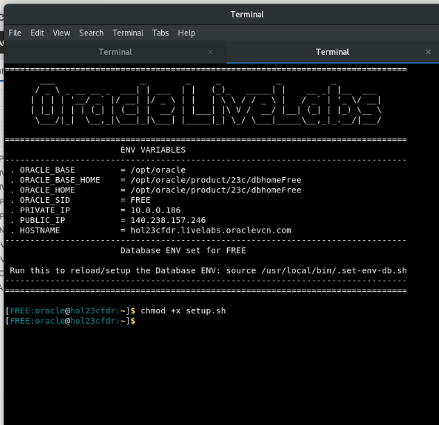
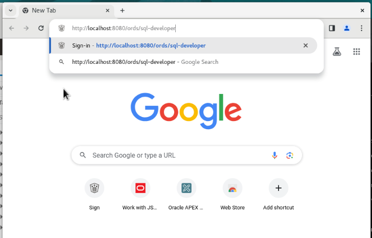

# Comprehensive Domain Exploration in Oracle Database 23c

## Introduction

Welcome to the "Comprehensive Domain Exploration in Oracle Database 23c" lab! Domains play a crucial role in ensuring data integrity and consistency within database applications. In this lab, we will thoroughly explore domains in Oracle Database 23c, covering single column domains, multi-column domains, and flexible domains. Through practical examples, you will gain a deep understanding of how domains can be defined, applied, and utilized to maintain data quality.

### Objective:
The objective of this lab is to provide comprehensive hands-on experience with domains in Oracle Database 23c. By the end of this lab, you will be proficient in defining various types of domains, applying them to tables, and leveraging domain functions for effective data management.

### Prerequisites:
- Access to Oracle Database 23c.
- Basic understanding of SQL concepts.


## Task 1: Lab setup

1. To begin, let's set up the lab environment. First, ensure that the lab setup script is executable by running the following command:

    ```
    <copy>
    chmod +x setup.sh
    </copy>
    ```
    

2. Execute the setup script by running:

    ```
    <copy>
    ./setup.sh
    </copy>
    ```

    

3. Now, paste the following URL into the Google Chrome search bar:

    ```
    <copy>
    http://localhost:8080/ords/sql-developer
    </copy>
    ```
    


4. Sign in to SQL Developer Web using the movie schema with the **username movie and password movie**.

    

5. Click on the SQL tile.

    


## Task 2: Understanding Domains

1. **Overview of Domains:**
   Domains serve as a way for defining properties and constraints associated with columns. They ensure consistency in data representation and validation throughout the application.

2. **Types of Domains:**
   - Single Column Domain: Applies constraints to a single column.
   - Multi-Column Domain: Applies constraints to multiple columns.
   - Flexible Domain: Allows dynamic selection of domains based on specific conditions.

## Task 3: Creating and Implementing Domains

1. Single Column Domain Example: From the explanation above lets see what each of the tree types of domains look like. We'll start by creating a single column domain for storing product prices. We will enforce a constraint to ensure that prices are positive numbers.

    ```
    <copy>
    -- Drop the domain if it already exists
    drop domain if exists price force;

    -- Creating a single column domain
    create domain price as number
    constraint price check (value > 0);
    </copy>
    ```
2. Multi-Column Domain Example: Next, we'll create a multi-column domain to represent geographical coordinates. This domain will enforce constraints on latitude and longitude values.

    ```
    <copy>
    -- Drop the domain if it already exists
    drop domain if exists coordinates force;

    -- Creating a multi-column domain
    create domain coordinates as (
        latitude  as number,
        longitude as number,
        location_name as varchar2 (100)
    )
    constraint coordinates check (latitude between -90 and 90 and longitude between -180 and 180);
    </copy>
    ```
3. Flexible Domain Example: For the flexible domain, let's consider a scenario where we want to store contact information for individuals. We'll create domains for different types of contacts and dynamically select the appropriate domain based on the contact type.

    ```
    <copy>
    -- Drop the domains if they already exists
    drop domain if exists personal_contact_dom force;
    drop domain if exists business_contact_dom force;
    drop domain if exists default_contact_dom force;

    -- Personal contact domain
    create domain personal_contact_dom as (
        first_name     as varchar2(50),
        last_name      as varchar2(50),
        email          as varchar2(100),
        phone          as varchar2(20)
    )
    constraint personal_contact_dom check (first_name is not null and 
                                           phone is not null);

    -- Business contact domain
    create domain business_contact_dom as (
        company_name   as varchar2(100),
        first_name     as varchar2(50),
        last_name      as varchar2(50),
        email          as varchar2(100),
        phone          as varchar2(20)

    )
    constraint business_contact_dom check (first_name is not null and 
                                           phone is not null);

    -- Default contact domain
    create domain default_contact_dom as (
        first_name     as varchar2(50),
        last_name      as varchar2(50),
        email          as varchar2(100),
        phone          as varchar2(20)
    )
    constraint default_contact_dom check (first_name is not null and 
                                           phone is not null);

    -- Flexible domain to choose contact based on type
    create flexible domain contact_flex_dom (company_name, first_name, last_name, email, phone)
    choose domain using (contact_type varchar2(100))
    from case
        when contact_type = 'personal' then personal_contact_dom(first_name, last_name, email, phone)
        when contact_type = 'business' then business_contact_dom(company_name, first_name, last_name, email, phone)
        else default_contact_dom(first_name, last_name, email, phone)
    end;


    </copy>
    ```
4. Oracle Database 23ai also has some pre-created domains that we can use with many more on the way. Lets see what those are.

    ```
    <copy>
    select name as "System provided domains" from all_domains where owner = 'SYS'
    </copy>
    ```

## Task 4: Implementing and Utilizing Domains in Tables for Data Management  
1. Now, let's create some tables and apply our domains.

    ```
    <copy>

    -- Drop table with single column domain if exists
    drop table if exists products purge;

    -- Table with single column domain
    create table products (
        product_id   number,
        name         varchar2(100),
        price        price          -- User defined domain
    );

    -- Drop table with multi-column domain if exists
    drop table if exists locations purge;

    -- Table with multi-column domain
    create table locations (
        location_id     number,
        latitude        number,
        longitude       number,
        location_name   varchar2(100),
        domain  coordinates_dom(latitude, longitude, location_name)    -- User defined domain
    );

    -- Drop table with flexible domain if exists
    drop table if exists contacts purge;

    -- Table with flexible domain
    create table contacts (
        contact_id     number,
        contact_type   varchar2(100),
        company_name   varchar2(100),
        first_name     varchar2(50),
        last_name      varchar2(50),
        email          varchar2(100),
        phone          phone_number_d,      -- System provided domain
        domain         contact_flex_dom(company_name, first_name, last_name, email, phone) using (contact_type) -- User defined domain
    );

    </copy>
    ```
3. 
2. We can now insert sample data into the created tables to test domain constraints. The Widget will get inserted into our table and the Gadget will fail because the it fails our constraint of only positive numbers in the price domain.

    ```
    <copy>
    -- Inserting data into products table
    insert into products (product_id, name, price) values (1, 'Widget', 10.99);
    insert into products (product_id, name, price) values (2, 'Gadget', -5.99); -- This will fail

    </copy>
    ```
3. Now we can insert into our multi-column domain table and our flexible domain table. Again our fist insert into the locations table will fail because our latitude is greater than 90 but our second insert statement will pass because the constraints are correct. 
    ```
    <copy>
    -- Inserting data into locations table with multi-column domain
    insert into locations (location_id, location_name, latitude, longitude) 
    values (1, 'Headquarters', 100.7749, -122.4194); -- This will fail 

    insert into locations (location_id, location_name, latitude, longitude) 
    values (2, 'Branch Office', 40.7128, -74.0060);


    -- Inserting a personal contact
    insert into contacts (contact_id, contact_type, first_name, last_name, email, phone)
    values (1, 'personal', 'John', 'Doe', 'john.doe@example.com', 1231231231);

    </copy>
    ```

## Task 5: View, drop and alter domains
1. We can view our domains to see their information. The dictionary views: [USER|DBA|ALL]\_DOMAINS and [USER|DBA|ALL]\_DOMAIN_COLS represent domains and provide the following information about the domain columns. For flexible domains, the views also include the domain selector expression. 


2. Lets take a look at the domains we've created and the associated information.

    ```
    <copy>
    select * from USER_DOMAIN_CONSTRAINTS;
    </copy>
    ```
2. You can also alter and drop domains, here is a small example.

    ```
    <copy>
    -- Dropping a Domain
    drop domain if exists price;

    -- Altering a Domain
    alter domain coordinates add constraint coordinates check (latitude between -90 and 90 and longitude between -180 and 180 and location_name is not null);
    </copy>
    ```
4. Domains play a crucial role in maintaining data integrity and consistency within database applications. Feel free to explore more advanced features and experiment with different domain types to enhance your database development skills.

If you have any questions or want to delve deeper into specific topics, refer to the Oracle documentation or continue experimenting on your own.
## Learn More

* [Application Usage Domains Documentation](https://docs.oracle.com/en/database/oracle/oracle-database/23/cncpt/application-data-usage.html#GUID-40EF7B72-ECE3-4BF1-B7CF-0C88B810C9F6)
* [SQL Domains Blog](https://blogs.oracle.com/coretec/post/less-coding-with-sql-domains-in-23c)


## Acknowledgements
* **Author** - Killian Lynch, Oracle Database Product Manager
* **Contributors** - Dom Giles, Distinguished Database Product Manager
* **Last Updated By/Date** - Killian Lynch, Oracle Database Product Management, Product Manager, May 2023