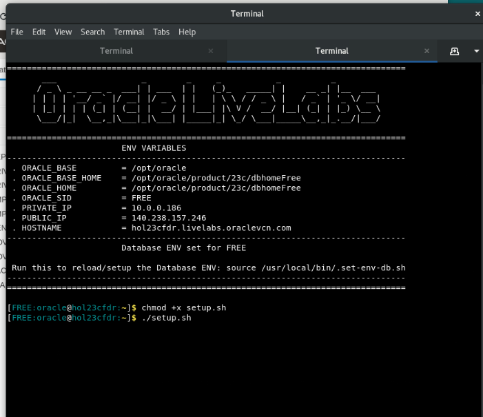
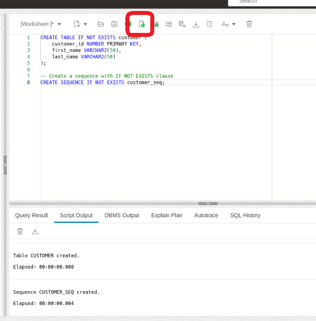
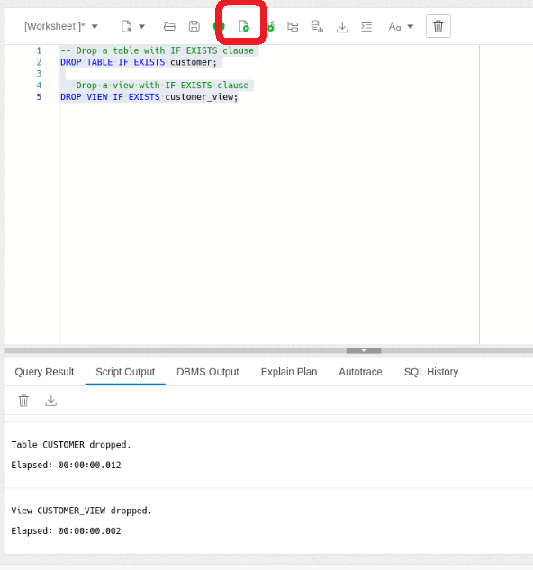
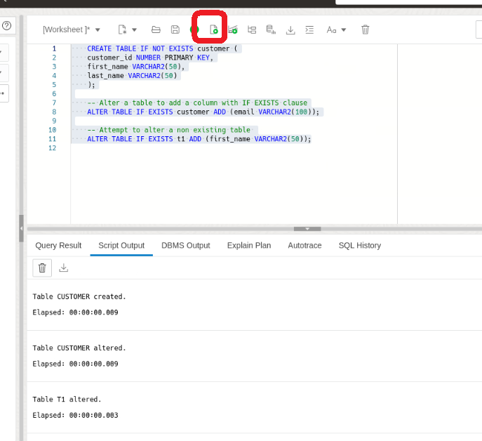

# Using "IF EXISTS" and "IF NOT EXISTS" in SQL Lab for Oracle Database 23c

## Introduction

Welcome to the "IF EXISTS" and "IF NOT EXISTS" Lab for Oracle Database 23c! In this lab, you will explore the usage of the "IF EXISTS" and "IF NOT EXISTS" statements in SQL within the context of Oracle Database 23c. These statements are powerful tools for conditionally executing SQL commands based on the existence or non-existence of certain conditions or objects within the database.

Oracle Database 23c continues to provide robust support for SQL commands, including various conditional statements like "IF EXISTS" and "IF NOT EXISTS". Understanding how to effectively use these statements can improve your database management and application development skills.

### Objective:
In this lab, you will learn how to use the "IF EXISTS" and "IF NOT EXISTS" statements in SQL within Oracle Database 23c. You will explore their usage for checking the existence or non-existence of tables, columns, and records, and execute conditional commands based on these checks. By the end of this lab, you will have a solid understanding of how to incorporate both "IF EXISTS" and "IF NOT EXISTS" into your SQL scripts, enabling you to write more dynamic and responsive database queries.

### Prerequisites:
- Access to Oracle Database 23c environment.
- Basic understanding of SQL.

## Task 1: Lab Setup

1. To begin, let's set up the lab environment. First, ensure that the lab setup script is executable by running the following command:

    ```
    <copy>
    chmod +x setup.sh
    </copy>
    ```
    

2. Execute the setup script by running:

    ```
    <copy>
    ./setup.sh
    </copy>
    ```

    

3. Now, paste the following URL into the Google Chrome search bar:

    ```
    <copy>
    http://localhost:8080/ords/sql-developer
    </copy>
    ```
    


4. Sign in to SQL Developer Web using the movie schema with the **username movie and password movie**.

    

5. Click on the SQL tile.

    

## Task 2: Exploring IF [NOT] EXISTS Clause

Now that your environment is set up, let's explore the usage of the IF [NOT] EXISTS clause in different scenarios:

1. In this task, we will create tables using the IF NOT EXISTS clause to ensure that they are only created if they don't already exist in the database.

    ```
    <copy>
    CREATE TABLE IF NOT EXISTS customer (
        customer_id NUMBER PRIMARY KEY,
        first_name VARCHAR2(50),
        last_name VARCHAR2(50)
    );

    -- Create a sequence with IF NOT EXISTS clause
    CREATE SEQUENCE IF NOT EXISTS customer_seq;
    </copy>
    ```
    

2. Now lets drop objects using the IF EXISTS clause, ensuring that errors are handled gracefully when attempting to drop non-existent and existing objects.

    ```
    <copy>
    -- Drop a table with IF EXISTS clause
    DROP TABLE IF EXISTS customer;

    -- Drop a view with IF EXISTS clause
    DROP VIEW IF EXISTS customer_view;
    </copy>
    ```
    

3. Here, we will experiment with altering objects using the IF EXISTS clause. First lets add the `customer` table since we dropped it above.

    ```
    <copy>

    CREATE TABLE IF NOT EXISTS customer (
    customer_id NUMBER PRIMARY KEY,
    first_name VARCHAR2(50),
    last_name VARCHAR2(50)
    );

    -- Alter a table to add a column with IF EXISTS clause
    ALTER TABLE IF EXISTS customer ADD (email VARCHAR2(100));

    -- Attempt to alter a non existing table 
    ALTER TABLE IF EXISTS t1 ADD (first_name VARCHAR2(50));
    </copy>
    ```
    
 

4. Congratulations! You've completed the Database Object Management Workshop. You've gained valuable insights into utilizing the IF [NOT] EXISTS clause in Oracle Database 23c for enhancing script robustness and minimizing errors in database change scripts.

## Learn More

* [Oracle Database 23c IF EXISTS and IF NOT EXISTS Documentation](https://docs.oracle.com/en/database/oracle/oracle-database/23/adfns/sql-processing-for-application-developers.html#GUID-3818B089-D99D-437C-862F-CBD276BDA3F1)

## Acknowledgements
* **Author** - Killian Lynch, Database Product Management
* **Contributors** - Killian Lynch, Database Product Management
* **Last Updated By/Date** - Killian Lynch, January 2023
