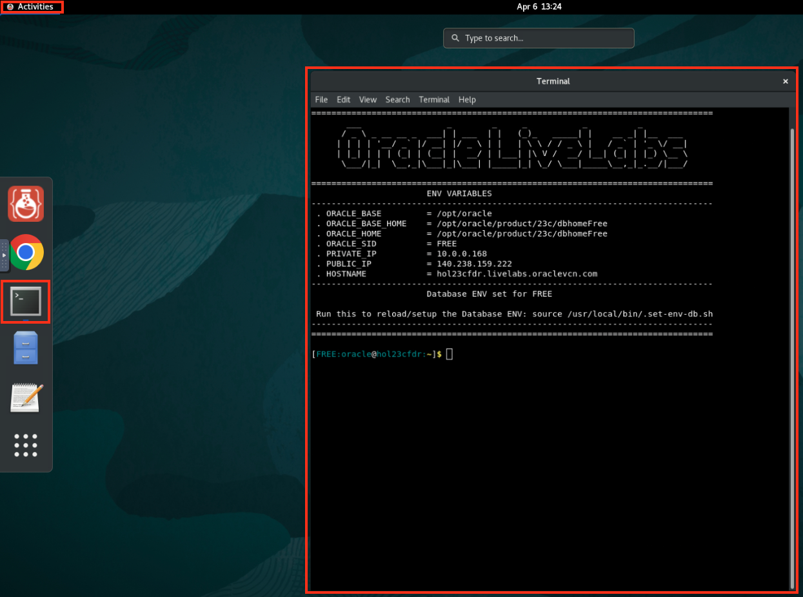
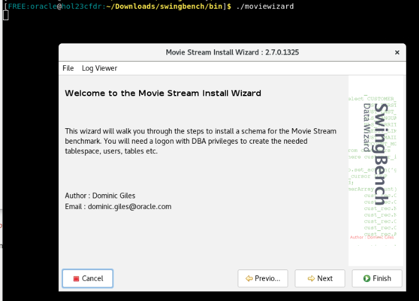
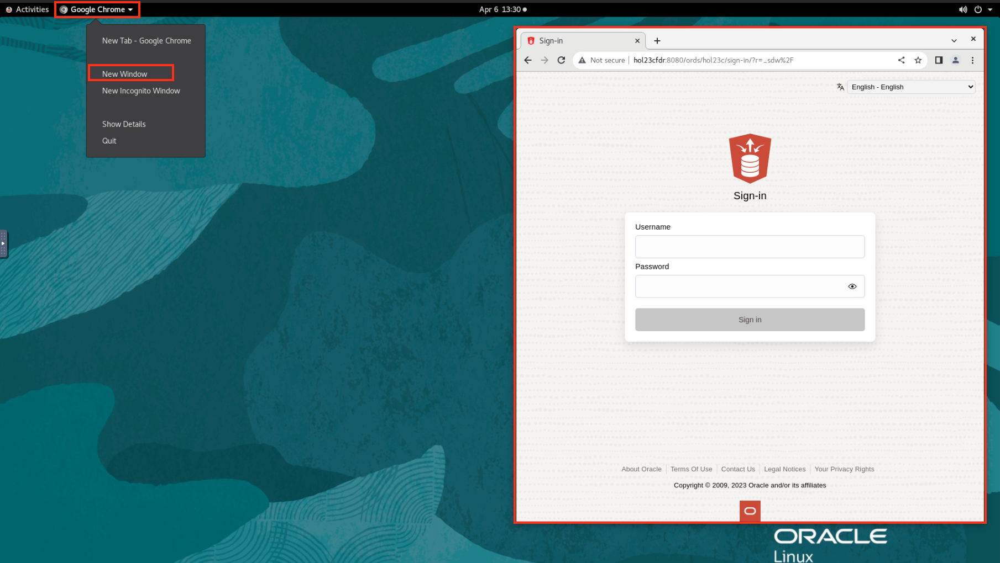

# Prepare your environment for the workshop 

## Introduction

This lab provides a step-by-step guide to help you get started with the JSON Duality LiveLab. In this lab, you will create the necessary schema and tables need for the following labs.

In this lab we will be installing Swingbech. Swingbench is a powerful performance testing tool for Oracle databases. It enables users to simulate realistic workloads, measure system performance, and evaluate scalability. With customizable workload models and comprehensive reporting, Swingbench assists in load testing, stress testing, and benchmarking Oracle environments. It helps identify bottlenecks, optimize configurations, and ensure the efficiency and reliability of Oracle-based applications. We will be focusing on the Oracle MovieStreams schema which will create the needed tablespace, users, tables etc. 

Estimated Time: 15 minutes

### Objectives

In this lab, you will:
* Install Swingbench
* Create the schema
* Start up ORDS
* Connect to SQL Developer Web via the browser

### Prerequisites

This lab assumes you have:
* Oracle Database 23c Free Developer Release
* A terminal or console access to the database
* Internet access

## Task 1: Install Swingbench

1. The first step is to get to a command prompt. If you need to open a terminal and you are running in a Sandbox environment click on Activities and then Terminal.

  

2. Next set your environment. The oraenv command will set all of the environment variables based on your database. When prompted type FREE for the database name or if you supplied a different database name use that.

    ```
    <copy>
    . oraenv
    </copy>
	```

    


3. Next click [here](https://www.dominicgiles.com/site_downloads/swingbench25052023_jdk11.zip) to download the latest version of Swingbench.

4. Once the download is complete, open a terminal or command prompt on your computer and navigate to the location where the file was saved on your computer.

    ```
    <copy>
    unzip ~/Downloads/swingbench02262023_jdk11.zip -d ~/Downloads
    </copy>
	```
    

5. Navigate to the directory where Swingbench is installed. If Swingbench is installed in the "swingbench" folder within your home directory, you can use the following command:

    ```
    <copy>
    cd Downloads/swingbench/bin
    </copy>

	```

  


6. Navigate to the directory where Swingbench is installed. If you changed the extraction location, navigate there.

    ```
    <copy>
    cd Downloads/swingbench/bin
    </copy>

	```

7. Once you are in the swingbench/bin directory, run the following command to execute the Movie Stream Install Wizard

    ```
    <copy>
    ./moviewizard
    </copy>
    ```

    This command starts the Movie Stream Install Wizard, which guides you through the installation and configuration process for the Movie Stream workload.
    

8. When the Movie Stream wizard opens, click **next** to get started.

9. Make sure the **Create the Movie Stream Schema** box is checked and click next.

    

10. Under the Connect string box, copy(ctrl + v) or type the following.

    ```
    <copy>
    //hol23cfdr.livelabs.oraclevcn.com:1521/FREEPDB1
    </copy>
    ```
    

11. Under the Administrator Password box, copy(ctrl + v) or type the following

    ```
    <copy>
    Welcome123#
    </copy>
    ```
    Once finished press **Next**
    
    


12. Change the username to **movie** and leave the default password of movie and click Next 

    

13. Accept the defaults for the Database options page and click **Next**

    

14. Change the size of the benchmark using the User defined scale to 0.5 and click **Next**

    

15. Accept the default Level of Parallelism at 8 and click **Finish**

    

16. This should take around 1-2 minutes to complete. You can continue onto the next section and let this run in the background.

    

## Task 2: Start ORDS

1. Open a new tab in the terminal by selecting **File** and **New Tab** 

    

2. The first thing we are going to do is rest enable our new movie schema. Sign into sqlplus using the new movie user the swingbench just created. Once the movie schema has been created. Copy the following into the terminal.


    ```
    <copy>
    sqlplus movie/movie@//localhost:1521/FREEPDB1
    </copy>
    ```
    

3. Run the following

    ```
    <copy>
    BEGIN
        ORDS.ENABLE_SCHEMA(p_enabled => TRUE, p_schema => 'MOVIE');
        END;
        /
    </copy>
    ```
    

4. Now we will start ORDS, first exit out of SQL plus

    ```
    <copy>
    exit
    </copy>
    ```
    

5. To start ORDS, from the same command prompt use the following command. The output of [1] 204454 is just an example, your output could be different.

    ```
	<copy>
    ords serve &
    </copy>
	```
    

4. If running in a Sandbox go to Activities and then at the top click on new window. If Chrome is not running then click on Chrome.

    

5. The address for SQL Developer Web on your machine is below. Copy and paste that into the browser. Note: If you did not start ORDs, ORDs stopped working or you closed that terminal in the previous lab, go back and complete the steps in that lab to start ORDs otherwise it will not be running to login here.

    ```
    <copy>
    http://localhost:8080/ords/sql-developer
    </copy>
    ```

5. Sign in to SQL Developer with our movie schema with the username movie and password movie

    

You have finished the setup for this lab. You may now continue to the next lab.


## Learn More

* [Introducing Oracle Database 23c Free – Developer Release](https://blogs.oracle.com/database/post/oracle-database-23c-free)

## Acknowledgements
* **Author** - Killian Lynch
* **Contributors** - Dominic Giles
* **Last Updated By/Date** - Killian Lynch, Database Product Management, May 2023
