# Populate, Query, and Update Duality Views with REST

## Introduction

This lab focuses on populating, querrying and updating the duality views -- and therefore the underlying tables -- with POST, GET and PUT calls. You will use REST calls to upload data into your database with the json documents you downloaded in the previous lab. 

Note that while you are POST directly to a duality view, nothing is actually stored within the view. All of the inserted data will be stored on the tables that make up the view. 

Estimated Time: 5 minutes


### Objectives

In this lab, you will:

- Download the files used in this workshop. 
- Insert a single document to team\_dv
- Bulk insert documents on team\_dv and race\_dv

### Prerequisites

This lab assumes you have:
- Oracle Database 23c Free Developer Release
- All previous labs successfully completed
- Oracle REST Data Service (ORDS) 23.1

## Task 1: Use OpenAPI to run REST Calls in an IDE

The ORDS install comes with SQL Developer Web, an online tool for managing your database. In this tool, we can use OpenAPI to query our REST enabled views with a GUI. Follow these steps to use the IDE. 

1. Open a browser and navigate to this URL:  

    ```
    <copy>http://localhost:8080/ords/sql-developer</copy>
    ```

    Use the username and password you have setup for this workshop. In our case, our user is `movie`. 

    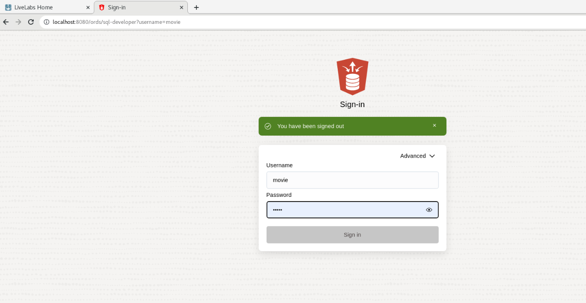

2. Click **SQL** under the development section. Now the first thing we want to do is rest enable our duality views. Using Oracle Database Actions Navigator on the left side of the screen **Click** the drop down arrow for the box showing the Tables objects and select **Views**. See picture below.

    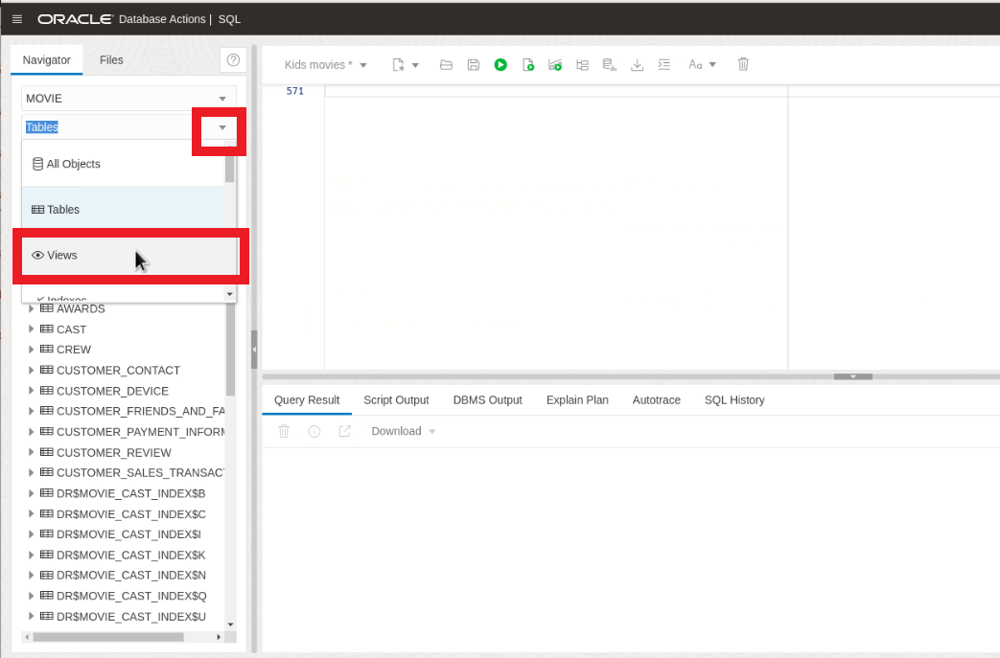

3. Right click on the `GENRES_DV` and hover the mouse over REST and **Click** Enable.

    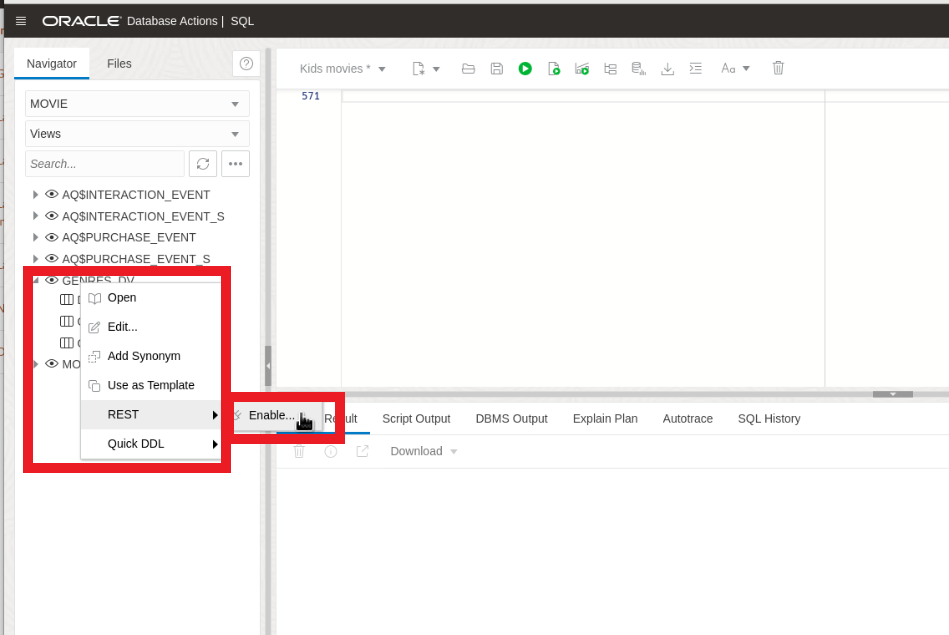

4. The REST Enable Object side panel will appear. **Select** Enable to continue.

    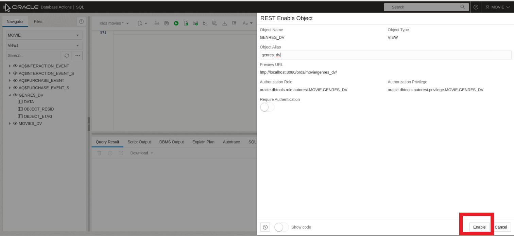

5. Lets do the same thing for the `MOVIES_DV`. This time lets do it using PL/SQL. Copy the following code and Select **Run Script**.
    ```
    <copy>
    BEGIN
        ORDS.ENABLE_OBJECT(
            P_ENABLED      => TRUE,
            P_SCHEMA      => 'MOVIE',
            P_OBJECT      =>  'MOVIES_DV',
            P_OBJECT_TYPE      => 'VIEW',
            P_OBJECT_ALIAS      => 'movies_dv',
            P_AUTO_REST_AUTH      => FALSE
        );
        COMMIT;
    END;
    </copy>
    ```
    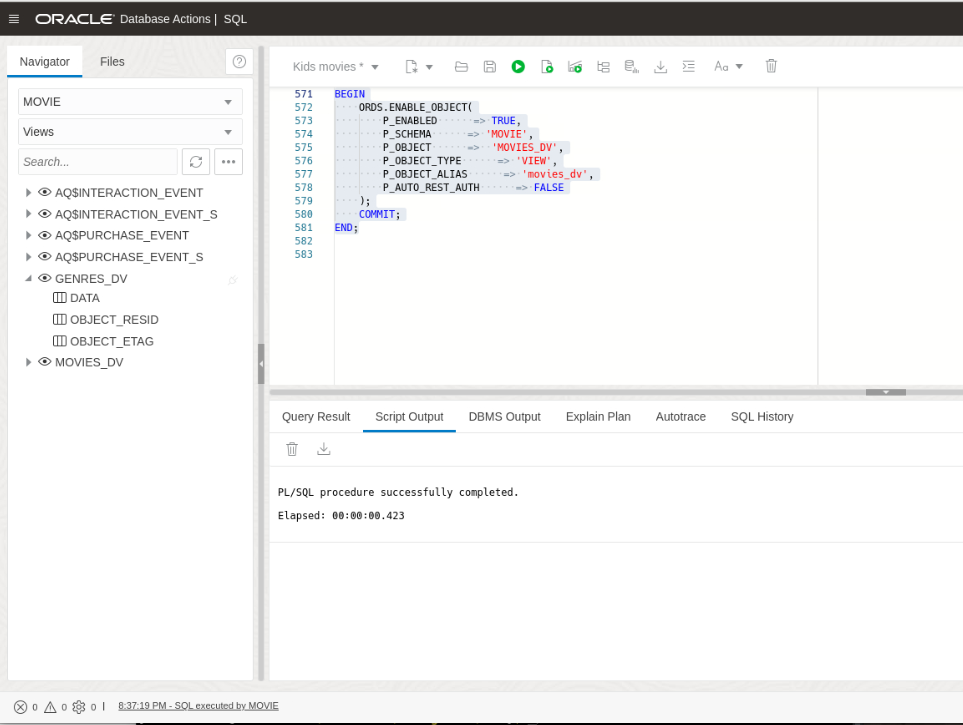


6. Click on **Oracle** in the upper left hand corner of the Database Actions page to return to the home screen. Click on **Rest** and then **AutoREST**.

    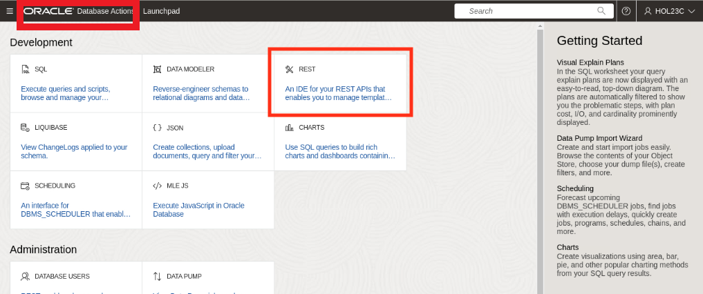

    

7. Now on any one of the views, you can click the three dots on the right and click **OpenAPI View**. Do this now for the `MOVIES_DV` view. 

    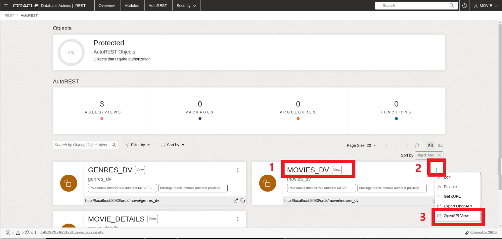

8. Here you can see the automatically configured REST calls that were enabled on the view.

    Expand the **GET** section. 

    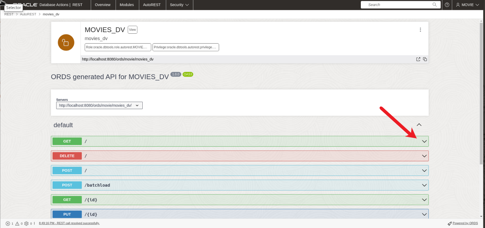

9. By default, this section shows sample parameters and responses, but we can use it to try the calls themselves. 

    Click on **Try it out**. 

    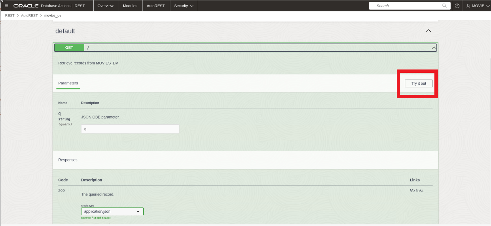

10. Fill in the **q** field with the following query parameters 

    ```
    <copy>{ "title": "Surfs Up" }</copy>
    ```

11. Now click **Execute** to run the REST call with the given parameters. 

    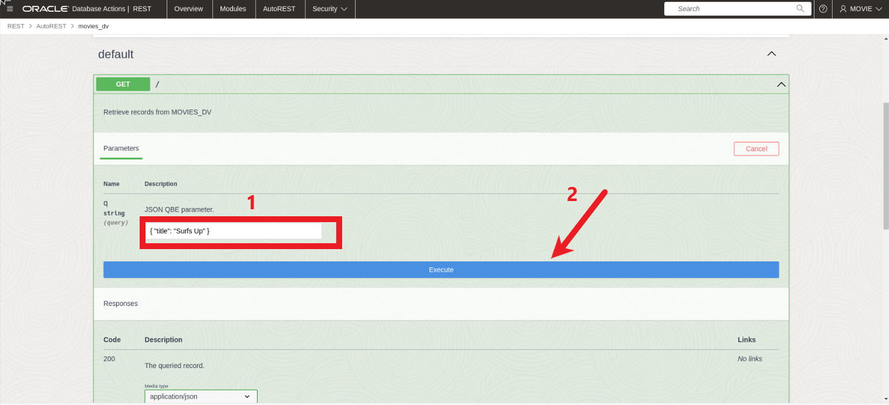

12. In the Responses section, you can now see that OpenAPI has built the call for you. You can see the cURL command and the request URL built from the query parameters you put in. 

    You can also see the response from the server below. We see the  information on the movie "Surfs Up".

    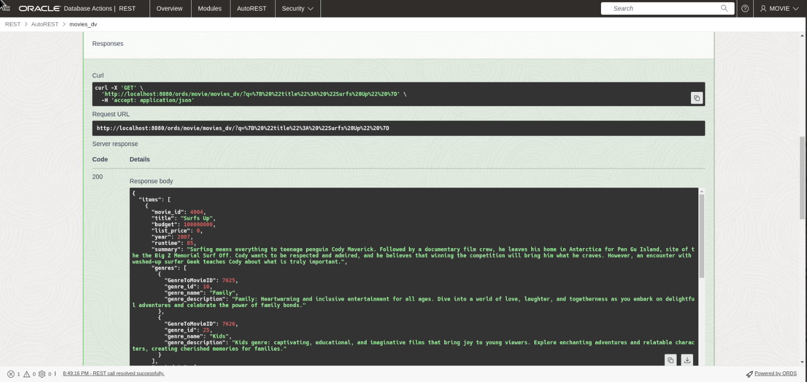

## Task 2: Use POST REST Calls

1. Similar to the labs before, lets add a new movie into our movies Duality View. This time we will be using the POST section. 

    Expand the **POST** section.
    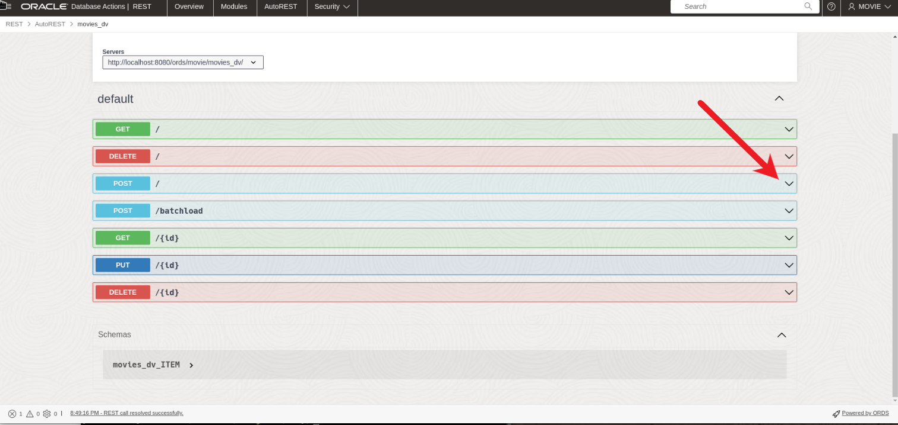

2. Like the GET section, by default, this section shows sample parameters and responses, but we can use it to try the calls themselves. 

    Click on **Try it out**. 
    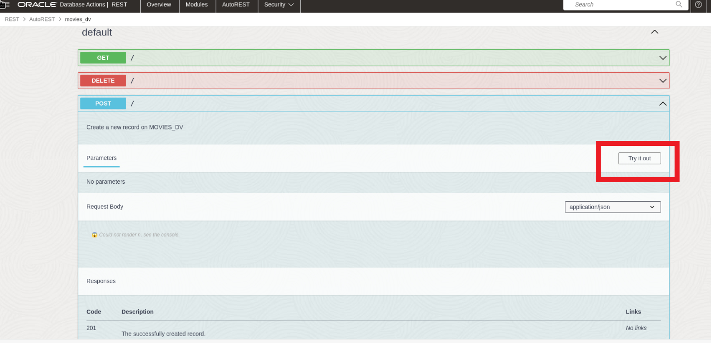

3. In the body request section copy and paste the following code and select Execute.

    ```
    <copy>
    {"movie_id" : 4008,
                "title" : "The Wizard of Oz",
                "budget" : 2800000,
                "list_price" : 0,
                "year" : 1939,
                "runtime" : 112,
                "summary" : "The Wizard of Oz is a beloved classic that follows the magical journey of Dorothy, a young girl whisked away to the enchanting Land of Oz. With her loyal companions—a scarecrow, a tin man, and a cowardly lion—Dorothy embarks on a quest to find the great Wizard, hoping he can help her return home. Along the yellow brick road, they encounter fantastical creatures, face wicked witches, and discover the power of friendship and believing in oneself in this timeless tale of courage and self-discovery.",
                "genres" : 
                [
                    {
                    "genre_id" : 25,
                    "genre_name" : "Kids"
                    },
                    {
                    "genre_id" : 10,
                    "genre_name" : "Family"
                    },
                    {
                    "genre_id" : 18,
                    "genre_name" : "Adventure"
                    }
                ]}
    </copy>
    ```
    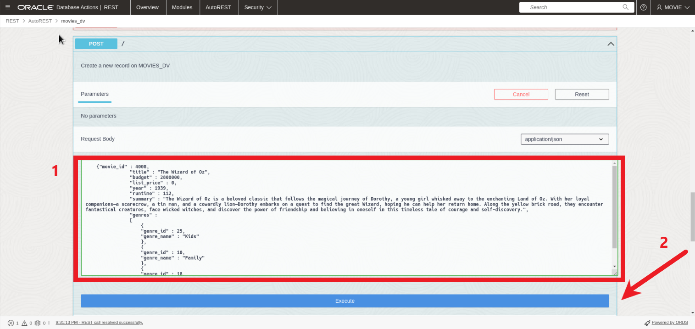
4. After executing the POST, we get the response that we successfully posted our new movie into the `MOVIES_DV`

    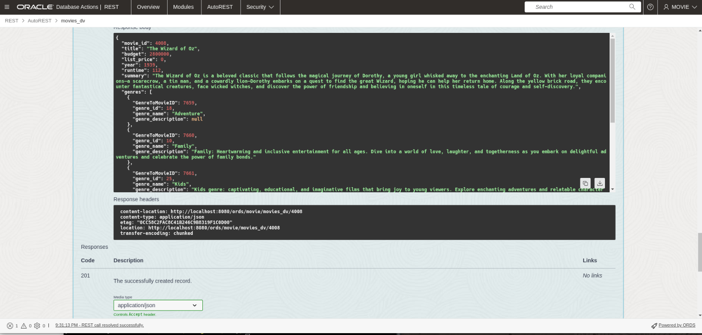

