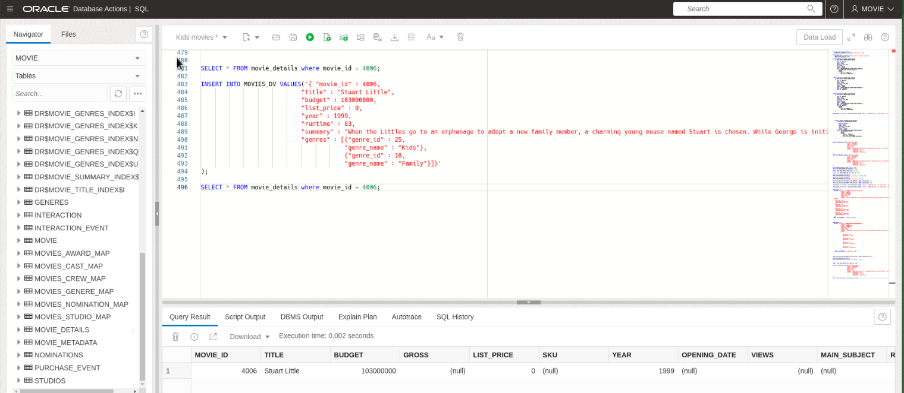
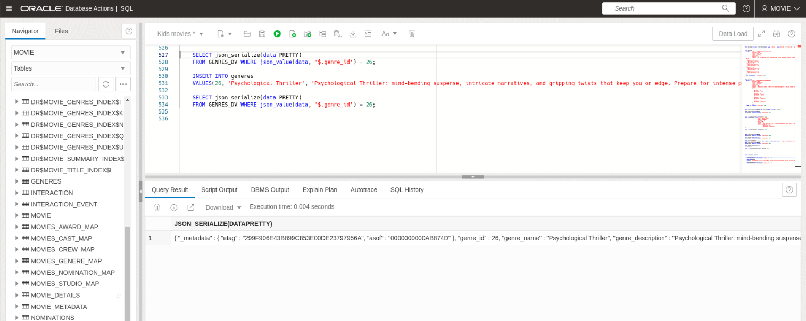
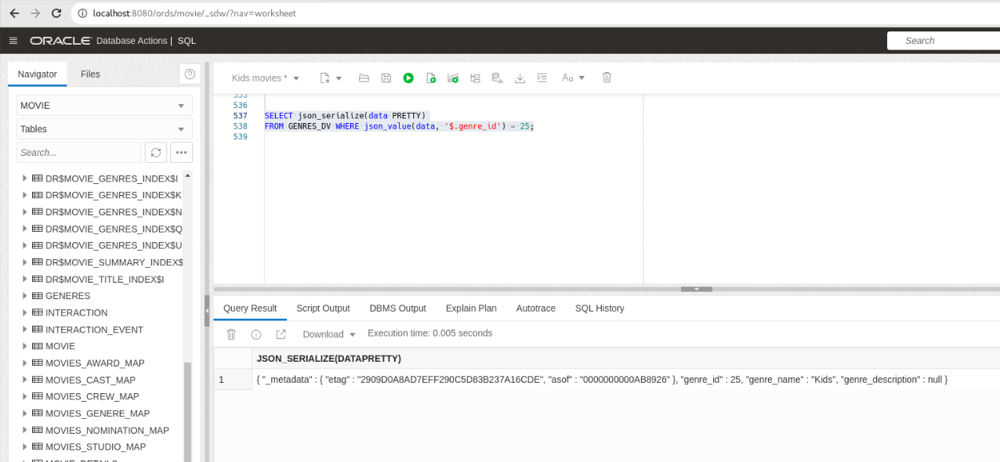
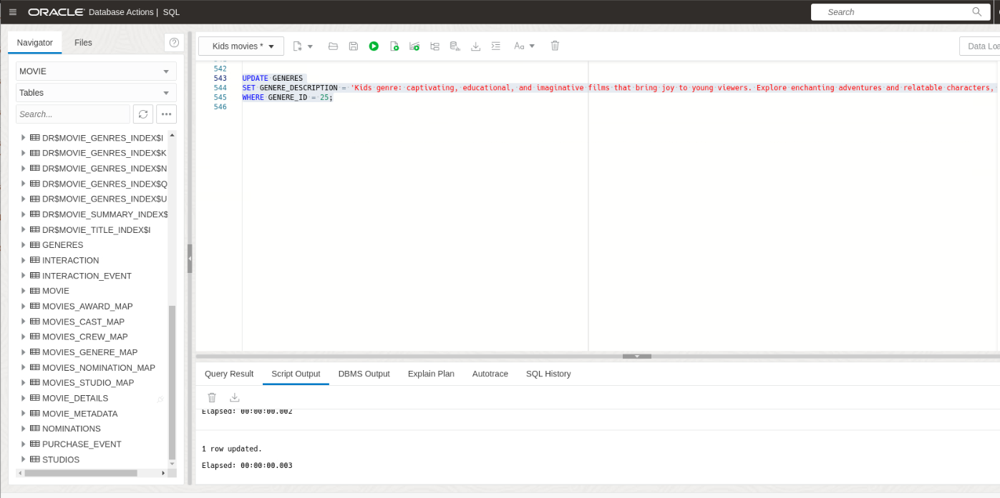
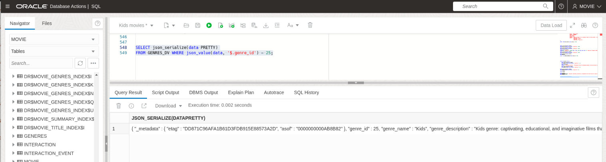
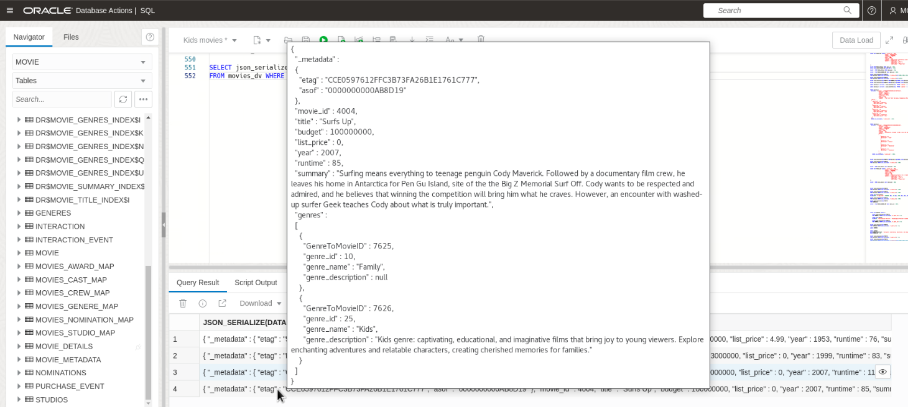
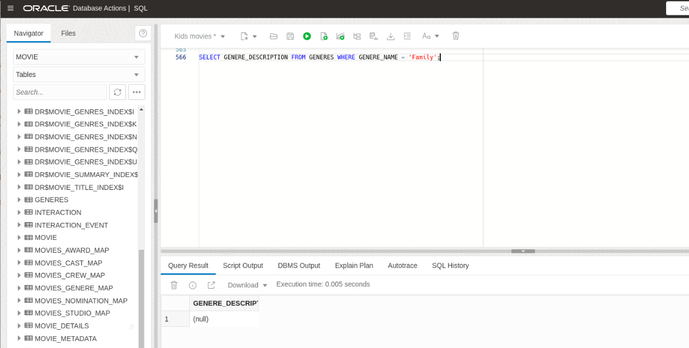
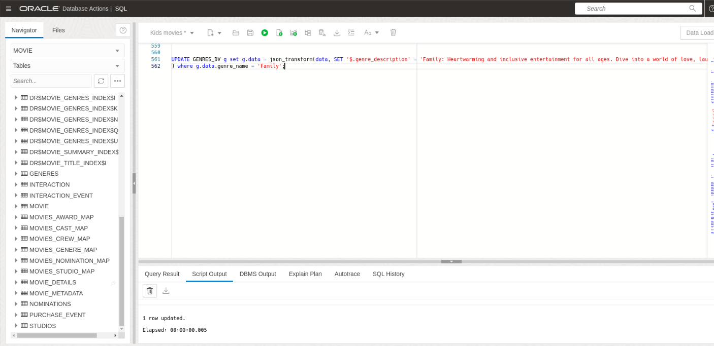
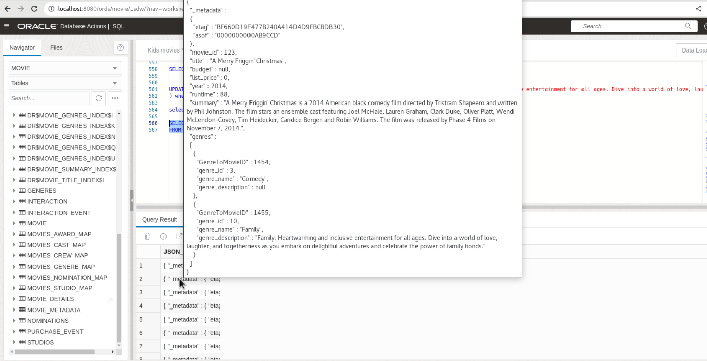

# The Extreme Flexibility of JSON Duality Views

## Introduction

This lab walks you through the steps to work with SQL data and JSON documents at the same time in the Oracle 23c database, looking at the true duality of the views.

Regardless of which one you choose to work with, the underlying result in the database is the same, with SQL access and JSON document access to all data. Developers now get the flexibility and data access benefits of the JSON document model as well as the storage efficiency and power of the relational model.

Estimated Time: 10 minutes

### Objectives

In this lab, you will:
* Insert and update on the Duality Views and SQL base tables

### Prerequisites

This lab assumes you have:
* Oracle Database 23c Free Developer Release
* All previous labs successfully completed
* SQL Developer Web 23.1 or a compatible tool for running SQL statements


## Task 1: Inserting into SQL tables and duality views
1. We mentioned how the underlying base tables get populated when you add an entry into the JSON duality view. Here we will check the base table to ensure the record does not exist, insert into the duality view, and then check the base table. Copy the code and click **Run Script**.

    ```
    <copy>
    SELECT * FROM movie_details where movie_id = 4006;

    INSERT INTO MOVIES_DV VALUES('{ "movie_id" : 4006,
                                "title" : "Stuart Little",
                                "budget" : 103000000,
                                "list_price" : 0,
                                "year" : 1999,
                                "runtime" : 83,
                                "summary" : "When the Littles go to an orphanage to adopt a new family member, a charming young mouse named Stuart is chosen. While George is initially unwelcoming so, he shows his beloved new family that great things can truly come in small packages.",
                                "genres" : [{"genre_id" : 25,
                                            "genre_name" : "Kids"},
                                            {"genre_id" : 10,
                                            "genre_name" : "Family"}]}'
    );

    SELECT * FROM movie_details where movie_id = 4006;
    </copy>
    ```
    

2. Now we will look at the opposite. Let's look at the duality view, insert into the base table and then check the duality view for the record. Copy the code and click **Run Script**.
    ```
    <copy>
    SELECT json_serialize(data PRETTY)
    FROM GENRES_DV WHERE json_value(data, '$.genre_id') = 26;

    INSERT INTO generes
    VALUES(26, 'Psychological Thriller', 'Psychological Thriller: mind-bending suspense, intricate narratives, and gripping twists that keep you on edge. Prepare for intense psychological tension and thrilling storytelling.');

    SELECT json_serialize(data PRETTY)
    FROM GENRES_DV WHERE json_value(data, '$.genre_id') = 26;
    </copy>
    ```
    
    

## Task 2: Update and replace a document by ID

1. In the last lab, you were able to insert into a SQL table and a document into the duality view and see the changes reflected accordingly. Here we are going to go one step further. Lets update the Kids genre table via SQL and we will see this reflected throughout all all documents that contain the Kids genre. Copy the code and click **Run Statement**.

    ```
    <copy>
    SELECT json_serialize(data PRETTY)
    FROM GENRES_DV WHERE json_value(data, '$.genre_id') = 25;
    </copy>
    ```
    We see that we have the kids genre but there is no description. Lets update this via SQL

    

2. Copy the code and click **Run Statement** to update the description of the kids genre.
 
    ```
    <copy>
    UPDATE GENERES
    SET GENERE_DESCRIPTION = 'Kids genre: captivating, educational, and imaginative films that bring joy to young viewers. Explore enchanting adventures and relatable characters, creating cherished memories for families.'
    WHERE GENERE_ID = 25;
    </copy>
    ```
    

3. Now lets check the Genres table again. Copy the code and click **Run Statement**
    ```
    <copy>
    SELECT json_serialize(data PRETTY)
    FROM GENRES_DV WHERE json_value(data, '$.genre_id') = 25;
    </copy>
    ```
    We see now that the Kids genre has a new description.

    

4. Let's go one step further and check the all movies that contain the kids genre to see the new updated description. Copy the code and click **Run Statement** 
    ```
    <copy>
    SELECT json_serialize(data PRETTY)
    FROM movies_dv WHERE json_value(data, '$.movie_id') IN (4004, 4005, 2355, 4006);
    </copy>
    ```
    

5. Finally, since we made an update via a SQL Insert statement, Lets insert via the Duality View. Lets add a description to the family genre. First check the current description. Copy the code and click **Run Statement**

    ```
    <copy>
    SELECT GENERE_DESCRIPTION FROM GENERES WHERE GENERE_NAME = 'Family';
    </copy>
    ```
    

6. Now update the genres duality view. Copy the code and click **Run Statement**
    ```
    <copy>
    UPDATE GENRES_DV g set g.data = json_transform(data, SET '$.genre_description' = 'Family: Heartwarming and inclusive entertainment for all ages. Dive into a world of love, laughter, and togetherness as you embark on delightful adventures and celebrate the power of family bonds.') WHERE g.data.genre_name = 'Family';
    </copy>
    ```
    

7. Lastly, lets take a look at out new Family secription in some of the duality views that contain the Family genre. Copy the code and click **Run Statement**
    ```
    <copy>
    SELECT json_serialize(data PRETTY)
    FROM movies_dv WHERE json_value(data, '$.movie_id') IN (4004, 4005, 2355, 4006, 123, 124, 167, 190, 198, 212, 227);
    </copy>
    ```
    


8. Lets take a second to recap what we just did. We showed that with JSON Relational Duality Views can can work with data in either JSON Document format **OR** SQL Relational format and the changes are reflected through views to the corresponding documents and tables. This is game changing. For example, rather than having to go through every document that has the Family or Kids genre to make the change to their descriptions, we update the the view and it is reflected in the underlying table or we update the table and all documents associated are updated.


## Learn More

* [JSON Relational Duality: The Revolutionary Convergence of Document, Object, and Relational Models](https://blogs.oracle.com/database/post/json-relational-duality-app-dev)
* [JSON Duality View documentation](http://docs.oracle.com)
* [Blog: Key benefits of JSON Relational Duality] (https://blogs.oracle.com/database/post/key-benefits-of-json-relational-duality-experience-it-today-using-oracle-database-23c-free-developer-release)

## Acknowledgements
* **Author** - Killian Lynch
* **Contributors** - Dominic Giles
* **Last Updated By/Date** - Killian Lynch, Database Product Management, May 2023

