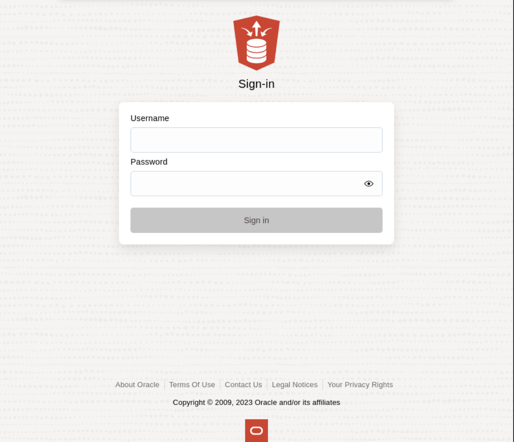
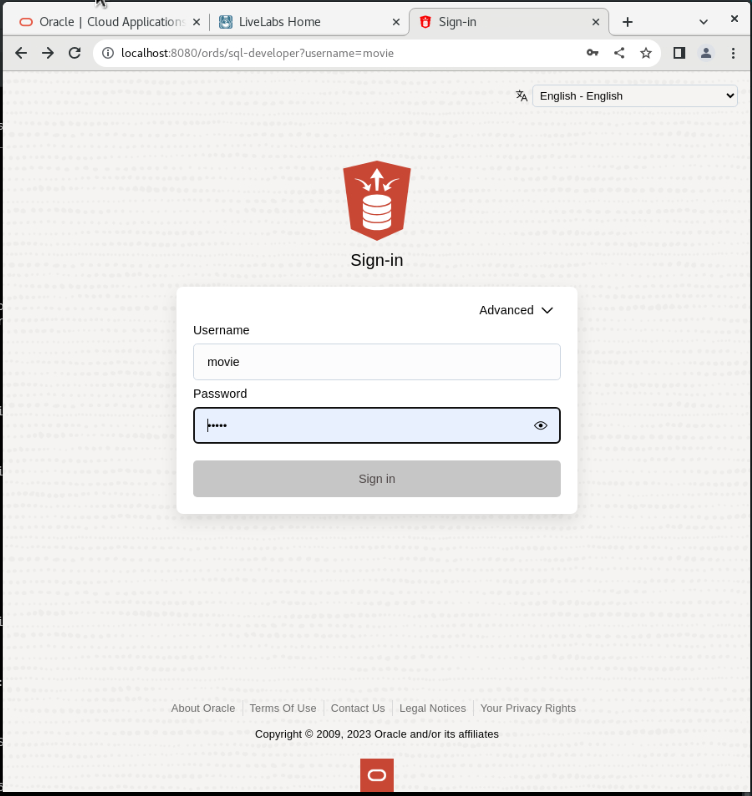

# Create the JSON Duality Views

## Introduction

This lab walks you through the setup steps to create the SON duality views needed to execute the rest of this workshop. 

Estimated Time: 10 minutes

### Objectives

In this lab, you will:
* Login as your database user
* Understanding your data 

### Prerequisites

This lab assumes you have:
* Oracle Database 23c Free Developer Release
* All previous labs successfully completed
* SQL Developer Web 23.1 or a compatible tool for running SQL statements

## Task 1: Connecting to your database user

1. Your browser should still be open, if not just open a new one. If running in a Sandbox go to Activities and then at the top click on new window. If Chrome is not running then click on Chrome.

    

2. The address for SQL Developer Web on your machine is below. Copy and paste that into the browser.
    **Note:** If you did not start ORDs, ORDs stopped working or you closed that terminal in the previous lab, go back and complete the steps in that lab to start ORDs otherwise it will not be running to login here.
    ```
    <copy>
    http://localhost:8080/ords/sql-developer
    </copy>
    ```
    

3. To login use the username movie with the password you set in Lab 1 in the browser.

    

4. To be able to run SQL statements you will need the sql worksheet. Click on SQL to launch that.

    

5. You are now logged in and should be at a screen that looks like this.

        

## Task 2: Understanding the data
1. As you go through this workshop, we will specify click the Run button or Run Script button. The Run button runs just one SQL Statement and formats the output into a data grid. The Run Script button runs many SQL statements and spools their output. We will highlight which to use.

    

2. To make this workshop as realistic as possible, let us introduce the business scenario you will use during this workshop - **Oracle MovieStream**.

    

* Oracle MovieStream is a fictitious online movie streaming company. Customers log into Oracle MovieStream using their computers, tablets and phones where they are presented with a targeted list of movies based on their past viewing habits. The company is now looking for better, smarter ways to track performance, identifying customers to target with campaigns that promote new services, new movies and new viewing platforms. Many of the scenarios in this workshop will be based on challenges companies are seeing in their own businesses, and we hope the following labs and accompanying workshops will give you some insight into how Oracle can help you solve these common everyday business and technical challenges.

* During this workshop, our main focus will revolve around three essential tables: Genres, Movie\_details, and movies\_genre\_map. As we progress through the upcoming labs, we will delve into the creation of dual views spanning across these tables. Additionally, we will explore techniques for efficiently adding, updating, and manipulating the underlying data within these tables using the duality views.

You many now proceed to the next lab.

## Learn More

* [JSON Relational Duality: The Revolutionary Convergence of Document, Object, and Relational Models](https://blogs.oracle.com/database/post/json-relational-duality-app-dev)
* [JSON Duality View documentation](http://docs.oracle.com)
* [Blog: Key benefits of JSON Relational Duality] (https://blogs.oracle.com/database/post/key-benefits-of-json-relational-duality-experience-it-today-using-oracle-database-23c-free-developer-release)

## Acknowledgements
* **Author** - Killian Lynch
* **Contributors** - Dominic Giles
* **Last Updated By/Date** - Killian Lynch, Database Product Management, May 2023

